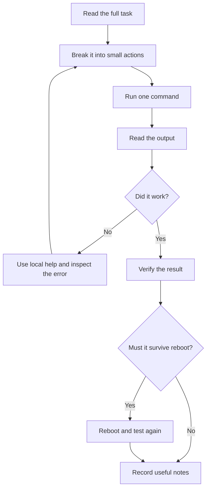

# Study Skills, Practice Discipline, and Offline Help

> Teach you how to learn Linux from zero, how to practice without wasting time, how to stay calm when stuck, and how to use offline documentation during RHCSA-style hands-on work.

## At a Glance

**Why this matters for RHCSA**

RHCSA is not a trivia exam. It is a performance exam. You pass by completing tasks correctly, verifying them, and making changes persist after reboot. If you panic, guess, or skip verification, you lose points even if you "almost" know the topic.

**Real-world use**

Real system administrators often work on systems without internet access, on servers where mistakes matter, and under time pressure. Good admins use local help, test carefully, and recover from errors without drama.

**Estimated study time**

3 hours for first study, plus repeat this file briefly every week.

## Prerequisites

None. This file assumes you are starting from zero.

## Objectives Covered

- Locate, read, and use system documentation including `man`, `info`, and files in `/usr/share/doc`
- Access a shell prompt and issue commands with correct syntax
- Build study and troubleshooting habits that support all RHCSA objectives
- Learn how to verify whether a task is complete and persistent after reboot

## Commands/Tools Used

`man`, `info`, `--help`, `help`, `type`, `which`, `command -v`, `whatis`, `apropos`, `pwd`, `ls`, `echo`, `history`, `clear`, `reset`, `script`, `cat`, `less`

## Offline Help References For This Topic

- `man man`
- `man info`
- `help help`
- `help type`
- `man which`
- `man command`
- `man whatis`
- `man apropos`
- `man hier`
- `man bash`
- `/usr/share/doc`

## Common Beginner Mistakes

- Trying to memorize everything before typing commands
- Guessing command syntax instead of checking help
- Copying commands without understanding them
- Forgetting whether you are root or a regular user
- Declaring a task done without verifying the result
- Making a configuration change but never testing after reboot
- Panicking after one error message

## Concept Explanation In Simple Language

Linux is learned by repeated contact, not by one perfect reading. At first, every command looks unfamiliar. That is normal. Your goal is not to "feel smart." Your goal is to build a reliable working process:

1. Understand the task.
2. Break it into smaller actions.
3. Run one command at a time.
4. Read the output.
5. Verify the result.
6. Reboot-check if the task must persist.



### How Linux Learning Works For Beginners

Beginners often think experts remember every command. In reality, experts remember patterns:

- where to look for help
- what type of tool solves a problem
- how to test safely
- how to confirm success

That means your first skill is not speed. Your first skill is method.

### How To Practice Effectively

Bad practice:

- reading a command and moving on
- doing a lab once
- skipping verification
- solving problems by random guessing

Good practice:

- typing commands by hand
- repeating tasks until you can do them without notes
- checking output every time
- rebooting to confirm persistence
- keeping short notes on mistakes and fixes

### How To Build Discipline And Learning Attitude

Use this rule: small daily practice beats rare long sessions.

A strong beginner habit:

- 60 to 90 minutes
- one topic
- type everything
- write down three things you learned
- write down one thing you got wrong

### How To Avoid Panic When Stuck

When stuck, do not say, "I know nothing." Ask smaller questions:

- What command am I trying to run?
- What file or service am I trying to affect?
- Am I in the right directory?
- Am I the right user?
- Did the command return an error?
- What does the manual say?

Panic shrinks when the problem becomes specific.

### How To Break Big Tasks Into Small Tasks

Example big task:

"Configure a service to start at boot and allow network access to it."

Break it into smaller tasks:

1. Identify the service name.
2. Install it if needed.
3. Start it now.
4. Enable it for boot.
5. Open the correct firewall service or port.
6. Test locally.
7. Reboot.
8. Test again.

### How To Check Your Own Work

Every admin task should end with proof. Examples:

- If you created a user, check `id username`
- If you edited a file, display the file
- If you enabled a service, check `systemctl is-enabled`
- If a service should be running, check `systemctl status`
- If a mount should persist, reboot and check `mount` or `findmnt`

### How To Recover From Mistakes

Most Linux mistakes are recoverable if you stay calm.

Useful recovery habits:

- read the full error message
- inspect the file before editing again
- make one correction at a time
- keep a backup copy before risky edits
- test immediately after changes

### How To Learn Without Internet

You do not need internet to keep learning basic administration if you know how to use local help. Linux systems already ship with documentation, examples, option summaries, and shell help.

!!! info "Exam Focus"
    Be fast with both `apropos keyword` and `man -k keyword`.
    They solve the same kind of problem: finding commands when you only remember the topic, not the exact command name.

Your offline help ladder:

1. `command --help`
2. `man command`
3. `info command`
4. `help builtin` for shell builtins
5. `apropos keyword`
6. `man -k keyword`
7. `/usr/share/doc/package-name`

### Notes That Are Useful In A Command-Line Exam

Your notes should not be essays. They should help you execute.

Good note format:

- task name
- key file or command
- one verification command
- one common failure and fix

Example:

```text
Check service boot persistence
systemctl enable --now httpd
Verify: systemctl is-enabled httpd ; systemctl is-active httpd
Failure: service starts now but not at boot -> forgot enable
```

### Reboot-Safe Thinking

On RHCSA, many tasks are only truly complete if they still work after reboot without manual repair. Always ask:

- Did I edit the right persistent config file?
- Did I only make a temporary runtime change?
- Did I enable the service, not just start it?
- Did I use UUID or label correctly in `/etc/fstab`?

### How To Think During A Hands-On Exam

Good exam thinking:

- Read the full task once.
- Mark required nouns: user, service, mount point, port, file.
- Mark required verbs: create, configure, enable, allow, persist.
- Solve the task in small chunks.
- Verify before moving on.

Bad exam thinking:

- starting immediately without reading carefully
- making several changes at once
- assuming success without checking
- spending too long guessing syntax you could look up

## Command Breakdowns

### `man`

```bash
man ls
```

What it does:

- Opens the manual page for `ls`.

Why it matters:

- Manual pages are available offline and are often enough to solve exam tasks.

Useful navigation inside `man`:

- `/word` searches forward
- `n` jumps to the next match
- `q` quits

### `info`

```bash
info coreutils 'ls invocation'
```

What it does:

- Opens GNU Info documentation. Some commands have more detailed examples in `info` than in `man`.

### `--help`

```bash
ls --help
```

What it does:

- Shows quick syntax and options.

Use it when:

- You need a fast reminder and do not want a full manual page.

### Shell `help`

```bash
help cd
```

What it does:

- Shows help for shell builtins such as `cd`, `echo`, and `history`.

### `type`

```bash
type cd
type ls
```

What it tells you:

- whether a name is a shell builtin, alias, function, or external command

### `which` and `command -v`

```bash
which ls
command -v ls
command -v cd
```

Why both matter:

- `which` is common and simple.
- `command -v` is shell-friendly and can identify builtins too.

### `whatis`

```bash
whatis passwd
```

What it does:

- Gives a one-line manual summary.

### `apropos`

```bash
apropos password
man -k password
```

What it does:

- Searches manual page descriptions by keyword.

### `/usr/share/doc`

```bash
ls /usr/share/doc
ls /usr/share/doc/bash
```

What it contains:

- package documentation
- examples
- README files
- configuration samples for some software

## Worked Examples

### Worked Example 1: Find Help For Changing Directories

Task: Learn how to get help for `cd`.

Commands:

```bash
type cd
help cd
```

Expected result:

- `type cd` should report that `cd` is a shell builtin.
- `help cd` should display syntax and behavior.

Verification:

- Confirm you did not use `man cd` expecting a normal external command manual.

### Worked Example 2: Search For A Command Related To Passwords

Task: Find local documentation related to passwords.

Commands:

```bash
apropos password
whatis passwd
man passwd
```

Expected result:

- `apropos` lists commands and manuals related to the word.
- `whatis passwd` shows a one-line summary.
- `man passwd` opens the manual page.

Verification:

- Search inside `man passwd` using `/password`.

### Worked Example 3: Inspect Documentation Under `/usr/share/doc`

Task: Find local package documentation.

Commands:

```bash
ls /usr/share/doc | head
ls /usr/share/doc/bash
less /usr/share/doc/bash/README
```

Expected result:

- You can list documentation directories.
- You can open a README file with `less`.

Verification:

- Quit `less` with `q`.

## Guided Hands-On Lab

### Lab Goal

Practice using offline help tools and build a calm troubleshooting workflow.

### Setup

Use any Linux shell as a regular user. If `man` pages are missing on your system, note that as a lab issue and continue with whatever local help is available.

### Task Steps

1. Open a shell.
2. Run `pwd`.
3. Find out whether `echo` is a builtin or external command.
4. Read shell help for `echo`.
5. Read the `man` page for `ls`.
6. Search the `ls` manual for the word `sort`.
7. Use `apropos` to search for commands related to `directory`.
8. Use `command -v` on `cd`, `ls`, and `man`.
9. Look in `/usr/share/doc` for documentation related to `bash`.
10. Create a note file called `study-notes.txt` and write down:
   - one builtin command
   - one external command
   - one place to search for manuals by keyword
   - one way to verify a task after configuration

### Expected Result

You can identify at least one builtin, one external command, and at least three offline help sources without using the internet.

### Verification Commands

```bash
type echo
command -v ls
apropos directory | head
ls /usr/share/doc/bash
cat study-notes.txt
```

### Cleanup

If you want:

```bash
rm -f study-notes.txt
```

## Independent Practice Tasks

1. Use local help to learn what `pwd` does and record one useful option if available.
2. Find out whether `history` is a builtin or external command.
3. Search manuals for a command related to `hostname`.
4. Open the manual for `less` and search for the word `pattern`.
5. Use `/usr/share/doc` to inspect documentation for any installed package and write one sentence about what you found.
6. Use `command -v` to compare `cd`, `cat`, and `type`.
7. Find help for clearing a broken terminal display using local documentation only.

## Verification Steps

1. You can correctly explain the difference between `help cd` and `man ls`.
2. You can use `apropos` or `man -k` to discover commands by keyword.
3. You can identify whether a command is a shell builtin or external program.
4. You created notes that include both execution steps and a verification step.

## Troubleshooting Section

### Problem: `man: command not found`

Possible cause:

- manual tools are not installed or your path is unusual

What to do:

- try `command -v man`
- use `--help`, `help`, and `/usr/share/doc` as fallback

### Problem: `whatis` or `apropos` returns nothing useful

Possible cause:

- manual page database may need updating on some systems

What to do:

- try searching with a different keyword
- fall back to `man -k`
- inspect `/usr/share/doc`

### Problem: `less /usr/share/doc/bash/README` says no such file

Possible cause:

- file names differ by package version

What to do:

- list the directory first with `ls /usr/share/doc/bash`

### Problem: terminal output looks broken

Try:

```bash
reset
```

### Problem: You forget whether you are root

Check:

```bash
whoami
pwd
```

## Common Mistakes And Recovery

- Mistake: using `man` for shell builtins first.
  Recovery: run `type commandname`, then use `help` if it is a builtin.

- Mistake: reading help but not testing anything.
  Recovery: run a small example immediately.

- Mistake: writing long notes that are hard to review.
  Recovery: shorten notes to command, purpose, verification.

- Mistake: assuming a task is done because no error appeared.
  Recovery: always run a verification command.

- Mistake: changing several things when one command failed.
  Recovery: undo the last change mentally, inspect output, then fix one issue at a time.

## Mini Quiz

1. What command gives help for a shell builtin such as `cd`?
2. What command helps you discover commands by keyword?
3. What does `type ls` tell you?
4. Where can package-specific local documentation often be found?
5. Why is "no error appeared" not enough to prove a task is complete?
6. What is the difference between starting a service now and making it start at boot?

## Exam-Style Tasks

### Task 1

Without using the internet, find local help that lets you answer these questions:

- Is `cd` a builtin or external command?
- What command can search manual descriptions by keyword?
- Where can package documentation usually be found on disk?

Write your answers into `/tmp/help-audit.txt`.

### Grader Mindset Checklist

- `/tmp/help-audit.txt` must exist
- the file should contain correct answers
- commands used should be available from local help
- no internet should be required

### Task 2

Create a plain-text note file `/tmp/exam-habits.txt` that lists:

- a four-step method for solving a hands-on Linux task
- one command to identify a command type
- one command to search manuals
- one command to verify whether a service is enabled at boot
- one reminder about reboot persistence

### Grader Mindset Checklist

- `/tmp/exam-habits.txt` must exist
- the file must contain all required items
- answers should be practical and command-based
- the verification command should be relevant to boot persistence

## Answer Key / Solution Guide

### Quiz Answers

1. `help cd`
2. `apropos keyword` or `man -k keyword`
3. It tells you what kind of command `ls` is and often where it resolves from.
4. Usually under `/usr/share/doc`
5. Because a task may fail silently, may affect the wrong target, or may not persist after reboot.
6. Starting affects the current session now. Enabling makes it start automatically at boot.

### Exam-Style Task 1 Example Solution

Possible command sequence:

```bash
type cd
apropos keyword
echo "cd is a shell builtin" > /tmp/help-audit.txt
echo "Use apropos or man -k to search manuals by keyword" >> /tmp/help-audit.txt
echo "Package documentation is usually under /usr/share/doc" >> /tmp/help-audit.txt
cat /tmp/help-audit.txt
```

### Exam-Style Task 2 Example Solution

Possible content:

```text
1. Read the task fully
2. Break it into smaller actions
3. Run one command at a time
4. Verify the result
type
apropos
systemctl is-enabled
Always check after reboot if the task must persist
```

## Recap / Memory Anchors

- Linux skill grows through repetition, not guessing.
- Local help is a core exam skill.
- `type` tells you what a command really is.
- `help` is for shell builtins.
- `man` and `info` are offline references.
- `/usr/share/doc` often contains examples.
- A task is not finished until you verify it.
- Persistent configuration must survive reboot.

## Quick Command Summary

```bash
type cd
help cd
man ls
info ls
ls --help
which ls
command -v ls
whatis passwd
apropos password
man -k directory
ls /usr/share/doc
less /usr/share/doc/bash/README
reset
```