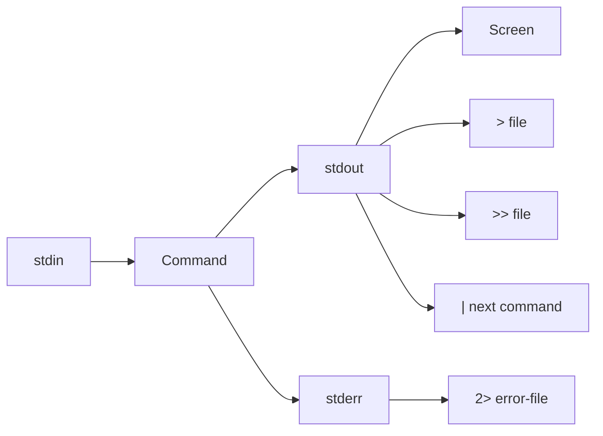

# Redirection, Pipes, Grep, and Regular Expressions

> Teach you how to control command input and output, connect commands together, and search text accurately with `grep` and basic regular expressions.

## At a Glance

**Why this matters for RHCSA**

RHCSA tasks often require extracting information from files, filtering command output, and saving results. If you cannot redirect output or search text quickly, you lose time on simple tasks.

**Real-world use**

Administrators constantly inspect logs, search configuration files, capture errors, and combine commands to answer specific questions fast.

**Estimated study time**

5 hours

## Prerequisites

- Read `00-study-skills-and-offline-help.md`
- Read `01-shell-basics-and-command-syntax.md`
- Read `02-files-directories-and-text-editing.md`

## Objectives Covered

- Use input-output redirection (`>`, `>>`, `|`, `2>`, and related forms)
- Use `grep` and regular expressions to analyze text
- Create and edit text files
- Use `sed` and `awk` for quick text extraction and transformation

## Commands/Tools Used

`echo`, `cat`, `grep`, `egrep` or `grep -E`, `head`, `tail`, `wc`, `sort`, `uniq`, `cut`, `tee`, `less`, `sed`, `awk`

## Offline Help References For This Topic

- `man bash`
- `man grep`
- `info grep`
- `grep --help`
- `man tee`
- `man cut`
- `man sed`
- `man awk`

## Common Beginner Mistakes

- Overwriting a file with `>` when you meant to append with `>>`
- Forgetting that `|` sends standard output, not errors
- Searching too broadly and not anchoring patterns
- Treating regex as magic instead of small matching rules
- Ignoring error output that should have been redirected separately

## Concept Explanation In Simple Language

Commands can send output to the screen, to a file, or to another command. This gives you control over information flow.



### Standard Streams

Linux commands commonly use three streams:

- standard input (`stdin`)
- standard output (`stdout`)
- standard error (`stderr`)

You do not need advanced theory. You do need to know how to direct them.

### Basic Redirection

- `>` writes standard output to a file and overwrites it
- `>>` appends standard output to a file
- `2>` writes errors to a file
- `2>>` appends errors to a file
- `|` sends standard output into the next command

### Basic Regex Mindset

A regular expression is a text pattern.

Common patterns:

- `^root` line starts with `root`
- `bash$` line ends with `bash`
- `.` any single character
- `.*` zero or more characters
- `[0-9]` one digit
- `[^#]` one character that is not `#`

For RHCSA, basic pattern matching is usually enough.

`sed` and `awk` are also important revision tools. They help when you need to change text quickly or print specific fields from structured output.

!!! info "Exam Focus"
    `grep`, `cut`, `sed`, and `awk` form a practical text-processing toolkit.
    You do not need advanced scripting to gain value from them.

## Command Breakdowns

### Redirect output

```bash
echo "hello" > file.txt
echo "again" >> file.txt
```

### Redirect errors

```bash
ls /does-not-exist 2> errors.txt
```

### Pipe output

```bash
cat /etc/passwd | grep root
```

### Search with `grep`

```bash
grep root /etc/passwd
grep -i root /etc/passwd
grep -n root /etc/passwd
grep -v '^#' file.conf
```

- `-i` ignore case
- `-n` show line numbers
- `-v` show non-matching lines

### Extended regex

```bash
grep -E 'root|student' /etc/passwd
grep -E '^[a-z].*bash$' /etc/passwd
```

### Replace text with `sed`

```bash
sed 's/http/https/' file.txt
sed -n '1,5p' file.txt
```

- `s/old/new/` substitutes text
- `-n` suppresses automatic printing
- `p` prints selected lines

### Extract fields with `awk`

```bash
awk -F: '{print $1}' /etc/passwd
awk '/bash$/ {print $1, $7}' /etc/passwd
```

- `-F:` sets `:` as the field separator
- `$1` means first field
- `$7` means seventh field

## Worked Examples

### Worked Example 1: Save Output and Append More

```bash
echo "line1" > sample.txt
echo "line2" >> sample.txt
cat sample.txt
```

Expected result:

- `sample.txt` contains two lines

Verification:

- `wc -l sample.txt` should report `2`

### Worked Example 2: Save Only Errors

```bash
ls /tmp /no-such-dir > good.txt 2> bad.txt
cat good.txt
cat bad.txt
```

Expected result:

- `good.txt` contains successful listing output
- `bad.txt` contains the error

Verification:

- both files should exist and contain different data types

### Worked Example 3: Find Interactive Shell Users

```bash
grep -E 'bash$|sh$' /etc/passwd
```

Expected result:

- lines ending with `bash` or `sh`

Verification:

- explain why `$` is useful here

### Worked Example 4: Print User Names With `awk`

```bash
awk -F: '{print $1}' /etc/passwd | head
```

Expected result:

- first field of each `/etc/passwd` line should be printed

Verification:

- confirm the output matches usernames only, not full lines

## Guided Hands-On Lab

### Lab Goal

Practice saving output, separating errors, filtering text, and using regex patterns.

### Setup

```bash
cd
mkdir -p rhcsa-redirection-lab
cd rhcsa-redirection-lab
```

### Task Steps

1. Create `users.txt` with five sample lines using `echo` and `>>`.
2. Display the file with line numbers using `grep -n`.
3. Save the current date into `report.txt`.
4. Append the hostname to `report.txt`.
5. Run a command that produces both normal output and an error, and save them to separate files.
6. Use `grep` to find lines containing `root`.
7. Use `grep -v` to show lines that do not start with `#` in a sample config file.
8. Use `grep -E` to match either `bash` or `nologin`.
9. Pipe `/etc/passwd` into `grep` and count matching lines with `wc -l`.
10. Use `tee` to both view and save filtered output.
11. Use `sed -n '1,3p'` to print only the first three lines of a file.
12. Use `awk -F:` to print only usernames from `/etc/passwd`.

### Expected Result

You can direct output intentionally and search files using exact text and simple regex patterns.

### Verification Commands

```bash
cat report.txt
cat good.out
cat errors.out
grep -n root users.txt
```

## Independent Practice Tasks

1. Create a file and append three separate lines to it.
2. Produce an error on purpose and capture it with `2>`.
3. Search `/etc/passwd` for lines that start with `root`.
4. Search `/etc/passwd` for lines ending in `nologin`.
5. Count how many non-comment lines exist in a sample file.
6. Use `sort` and `uniq` on a file with repeated words.
7. Pipe the output of `ls -l /etc` into `less`.
8. Use `sed` to replace one word with another in sample text.
9. Use `awk` to print the first and seventh fields from `/etc/passwd`.

## Verification Steps

1. Confirm you know when to use `>` versus `>>`.
2. Confirm you can capture errors separately with `2>`.
3. Confirm you can explain what `^` and `$` mean in basic regex.
4. Confirm a pipeline result by checking the final output carefully.
5. Confirm you can explain when `sed` is better for substitution and when `awk` is better for fields.

## Troubleshooting Section

### Problem: File got overwritten

Cause:

- you used `>` instead of `>>`

Fix:

- restore from backup if available
- use append carefully next time

### Problem: Error text still appears on screen

Cause:

- only standard output was redirected

Fix:

- redirect errors with `2>`

### Problem: `grep` matches too many lines

Cause:

- pattern too broad

Fix:

- anchor with `^` or `$`
- use more specific text

### Problem: `grep -E` behaves differently than expected

Cause:

- regex symbols were not quoted

Fix:

- quote the pattern:

```bash
grep -E 'root|student' file
```

## Common Mistakes And Recovery

- Mistake: placing the redirection in the wrong spot.
  Recovery: remember that redirection applies to the command output, not to the file name alone.

- Mistake: assuming pipes include error output.
  Recovery: they do not unless you redirect error into output deliberately.

- Mistake: forgetting to inspect saved files.
  Recovery: always `cat`, `less`, or `wc` the result.

- Mistake: using regex before understanding the exact text format.
  Recovery: inspect the file first with `cat` or `less`.

## Mini Quiz

1. What is the difference between `>` and `>>`?
2. What does `2>` redirect?
3. What does `|` do?
4. What does `^root` mean in `grep`?
5. What does `bash$` mean in `grep`?
6. What does `grep -v` do?
7. What does `awk -F:` change?
8. What does `sed 's/old/new/'` do?

## Exam-Style Tasks

### Task 1

Create `/tmp/account-report.txt` containing only the lines from `/etc/passwd` that end with `bash`. Then create `/tmp/account-count.txt` containing the number of such lines.

### Grader Mindset Checklist

- both files must exist
- report file must contain only matching lines
- count file must contain a numeric result

### Task 2

Run a command that lists `/tmp` and also attempts to list `/no-such-dir`. Save successful output to `/tmp/list-ok.txt` and errors to `/tmp/list-errors.txt`.

### Grader Mindset Checklist

- both output files must exist
- success file must contain directory listing output
- error file must contain the failure message

## Answer Key / Solution Guide

### Quiz Answers

1. `>` overwrites. `>>` appends.
2. Standard error.
3. Sends standard output into the next command.
4. A line starting with `root`.
5. A line ending with `bash`.
6. It shows non-matching lines.
7. It sets the field separator to `:`.
8. It substitutes the first matching `old` text on each line with `new`.

### Exam-Style Task 1 Example Solution

```bash
grep 'bash$' /etc/passwd > /tmp/account-report.txt
grep 'bash$' /etc/passwd | wc -l > /tmp/account-count.txt
```

### Exam-Style Task 2 Example Solution

```bash
ls /tmp /no-such-dir > /tmp/list-ok.txt 2> /tmp/list-errors.txt
```

## Recap / Memory Anchors

- `>` overwrite
- `>>` append
- `2>` errors only
- `|` connect commands
- `grep` finds text
- `^` start of line
- `$` end of line

## Quick Command Summary

```bash
echo "text" > file
echo "more" >> file
ls /tmp /bad 2> errors.txt
cat file | grep root
grep -n root /etc/passwd
grep -v '^#' file.conf
grep -E 'bash$|nologin$' /etc/passwd
tee saved.txt
```