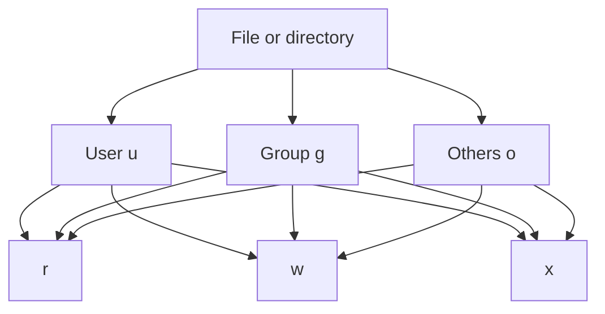
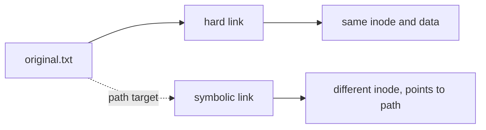

# Links, Permissions, and Default Permissions

> Teach you how hard links and symbolic links work, how standard `ugo/rwx` permissions are read and changed, and how default file permissions are influenced by `umask`.

## At a Glance

**Why this matters for RHCSA**

Permissions and links are core RHCSA tasks. Many failures that look like "Linux is broken" are really permission or path problems.

**Real-world use**

Admins manage shared directories, protect private data, and create links to files and directories for easier access or compatibility.

**Estimated study time**

5 hours

## Prerequisites

- Read `00-study-skills-and-offline-help.md`
- Read `01-shell-basics-and-command-syntax.md`
- Read `02-files-directories-and-text-editing.md`

## Objectives Covered

- Create hard and soft links
- List, set, and change standard `ugo/rwx` permissions
- Set special permissions (setuid, setgid, sticky bit)
- Configure set-GID directories for collaboration
- Manage default file permissions
- Diagnose and correct file permission problems

## Commands/Tools Used

`ls`, `ln`, `chmod`, `umask`, `touch`, `mkdir`, `stat`, `id`

## Offline Help References For This Topic

- `man ln`
- `man chmod`
- `help umask`
- `man umask`
- `man stat`

## Common Beginner Mistakes

- Confusing hard links and symbolic links
- Forgetting execute permission on directories
- Using the wrong permission target: user, group, or others
- Applying file-style thinking to directories
- Changing permissions without verifying the effect

## Concept Explanation In Simple Language

Permissions control who can do what.





The standard permission sets are:

- user (`u`)
- group (`g`)
- others (`o`)

The standard permission types are:

- read (`r`)
- write (`w`)
- execute (`x`)

### Reading `ls -l`

Example:

```text
-rw-r--r--
```

Meaning:

- file type: `-` regular file
- user: `rw-`
- group: `r--`
- others: `r--`

For directories:

- `r` lets you list names
- `w` lets you change entries
- `x` lets you enter the directory

### Hard Links vs Symbolic Links

Hard link:

- another directory entry pointing to the same file data
- usually cannot cross filesystems
- usually not for directories
- shares the same inode as the original file

An inode is the filesystem's internal identity record for a file. You do not need deep filesystem theory for RHCSA, but you should know this:

- same inode usually means the same underlying file data
- hard links share an inode
- symbolic links do not share the inode of their target

Symbolic link:

- a special file that points to a path
- can cross filesystems
- can point to directories

### Default Permissions and `umask`

`umask` removes permission bits from default creation modes.

Common idea:

- regular files often start from `666`
- directories often start from `777`
- `umask` subtracts from those defaults

### Special Permission Bits

Beyond `rwx` there are three special bits. They appear as a fourth, leading digit in numeric mode (`4`, `2`, `1`), and in `ls -l` they replace an `x` with `s`, `S`, `t`, or `T`.

| Bit | Numeric | On a file | On a directory |
|-----|:-------:|-----------|----------------|
| setuid | `4` | runs as the file's owner | (no standard effect) |
| setgid | `2` | runs as the file's group | new files inherit the directory's group |
| sticky | `1` | (no standard effect) | only the file owner (or root) can delete files in it |

Where you actually see them on RHEL:

- **setuid** — `ls -l /usr/bin/passwd` shows `-rwsr-xr-x`. The `s` in the user field lets any user run `passwd` with the owner's (root's) rights so they can update `/etc/shadow`.
- **setgid on a directory** — the key RHCSA pattern. Every file created inside a setgid directory takes the directory's group, so a whole team shares files automatically. This is why a collaborative directory is `2775`, not `775`.
- **sticky bit** — `ls -ld /tmp` shows `drwxrwxrwt`. Everyone can write in `/tmp`, but the trailing `t` stops users from deleting each other's files.

Reading the letter:

- lowercase `s`/`t` means the special bit **and** the underlying `x` are set
- uppercase `S`/`T` means the special bit is set but `x` is **not** — usually a mistake to fix

## Command Breakdowns

### Create links

```bash
ln original.txt hardlink.txt
ln -s original.txt symlink.txt
```

### Change permissions with symbolic mode

```bash
chmod u+x script.sh
chmod g-w file.txt
chmod o-r file.txt
chmod u=rw,g=r,o= file.txt
```

### Change permissions with numeric mode

```bash
chmod 644 file.txt
chmod 600 secret.txt
chmod 755 script.sh
chmod 700 private-dir
```

### Set special permission bits

```bash
chmod u+s program        # setuid (symbolic)
chmod g+s shareddir      # setgid (symbolic)
chmod +t /shared/upload  # sticky bit (symbolic)

chmod 4755 program       # setuid (numeric: leading 4)
chmod 2775 shareddir      # setgid (numeric: leading 2)
chmod 1777 /shared/upload # sticky (numeric: leading 1)
```

The leading digit adds to the normal three. `2775` = setgid (`2`) plus `rwxrwxr-x` (`775`).

### Check default mask

```bash
umask
umask -S
```

## Worked Examples

### Worked Example 1: Create Hard and Symbolic Links

```bash
echo "demo" > original.txt
ln original.txt hardlink.txt
ln -s original.txt symlink.txt
ls -li original.txt hardlink.txt symlink.txt
```

Verification:

- hard link and original should share the same inode
- symlink should show a different file type and a target path

### Worked Example 2: Lock Down a Secret File

```bash
echo "secret" > secret.txt
chmod 600 secret.txt
ls -l secret.txt
```

Verification:

- permissions should show `-rw-------`

### Worked Example 3: See the Effect of `umask`

```bash
umask
touch masktest.txt
mkdir maskdir
ls -ld masktest.txt maskdir
```

Verification:

- compare created permissions to the current `umask`

### Worked Example 4: Build a Set-GID Collaborative Directory

This is the canonical RHCSA group-collaboration task: a shared directory where every new file automatically belongs to the team group.

```bash
sudo groupadd devteam
sudo mkdir /srv/devshare
sudo chgrp devteam /srv/devshare
sudo chmod 2775 /srv/devshare
ls -ld /srv/devshare
```

Expected `ls -ld` output:

```text
drwxrwsr-x. 2 root devteam 6 ... /srv/devshare
```

Verification:

- the group field shows `rws` (the `s` is the setgid bit)
- a file created in the directory by any group member inherits group `devteam`, which you can prove with `ls -l` on the new file

## Guided Hands-On Lab

### Lab Goal

Create and inspect links, set permissions correctly, and observe default permission behavior.

### Setup

```bash
cd
mkdir -p rhcsa-perm-lab
cd rhcsa-perm-lab
```

### Task Steps

1. Create `report.txt` with one line of text.
2. Create a hard link named `report.hard`.
3. Create a symbolic link named `report.soft`.
4. List all three with `ls -li`.
5. Change `report.txt` permissions to `640`.
6. Create a directory `shared` and set permissions to `775`.
7. Create a directory `private` and set permissions to `700`.
8. Create a directory `team`, give it the setgid bit (`2775`), then create a file inside it and confirm the file inherited the directory's group.
9. Create a directory `dropbox` with the sticky bit (`1777`) and confirm the trailing `t` in `ls -ld`.
10. Display the symbolic form of `umask`.
11. Create a new file and new directory and inspect their permissions.
12. Remove the original file and observe what happens to the hard link and symbolic link.

### Expected Result

You can explain how links differ and you can set practical file and directory permissions confidently.

### Verification Commands

```bash
ls -li report.txt report.hard report.soft
ls -ld shared private team dropbox
umask -S
```

## Independent Practice Tasks

1. Create a file and both link types pointing to it.
2. Set a file so only the owner can read and write it.
3. Set a script file to be executable by everyone.
4. Create a directory that only root or the owner can access.
5. Change a file from numeric mode `644` to `600`.
6. Observe default permissions before and after changing `umask` in the current shell.

## Verification Steps

1. Confirm hard links share the same inode using `ls -i`.
2. Confirm symbolic links display with `l` in `ls -l`.
3. Confirm permission changes with `ls -l` or `stat`.
4. Confirm directory execute permission affects entry into the directory.

## Troubleshooting Section

### Problem: `Permission denied` on a directory

Cause:

- missing execute permission on the directory

Fix:

- inspect with `ls -ld dir`
- add `x` where appropriate

### Problem: Symbolic link is broken

Cause:

- target path is wrong or target file was removed

Fix:

- inspect with `ls -l`
- recreate the link with the correct path

### Problem: Hard link not allowed

Cause:

- target is on another filesystem or is a directory

Fix:

- use a symbolic link instead

### Problem: Permission change did not solve access issue

Cause:

- wrong user, wrong group, directory permissions, ACLs, or SELinux may also matter

Fix:

- verify identity and the whole path, not just one file

## Common Mistakes And Recovery

- Mistake: setting `777` everywhere.
  Recovery: use only the minimum needed permissions.

- Mistake: thinking file execute permission works the same as directory execute permission.
  Recovery: remember directory `x` means traversal or entry.

- Mistake: forgetting that symbolic links point to paths.
  Recovery: check link target with `ls -l`.

- Mistake: not verifying default permission behavior.
  Recovery: create a fresh file after checking `umask`.

## Mini Quiz

1. What is the difference between a hard link and a symbolic link?
2. What does `chmod 600 file` mean?
3. What does execute permission mean on a directory?
4. What command creates a symbolic link?
5. What command shows the shell's default permission mask?
6. Why might a symbolic link fail after the original file is removed?
7. What numeric mode makes a collaborative directory where new files inherit the group, and which bit does it set?
8. What does the sticky bit do on a world-writable directory like `/tmp`?

## Exam-Style Tasks

### Task 1

Create `/tmp/permtest.txt`, place text inside it, create:

- a hard link `/tmp/permtest.hard`
- a symbolic link `/tmp/permtest.soft`

Then set the original file permissions so only the owner can read and write it.

### Grader Mindset Checklist

- all three paths must exist
- hard link must share inode with the original
- symbolic link must point to the original path
- original file permissions must be `600`

### Task 2

Create a directory `/tmp/project-private` that only its owner can access, and a directory `/tmp/project-shared` that owner and group can fully use while others can only read and enter.

### Grader Mindset Checklist

- both directories must exist
- private directory should be `700`
- shared directory should be `775`

### Task 3

Create the group `engineers` and a collaborative directory `/srv/engineering` owned by group `engineers`, set up so that every file created inside it automatically belongs to the `engineers` group. Group members should be able to read, write, and enter; others should have no access.

### Grader Mindset Checklist

- group `engineers` must exist
- `/srv/engineering` group must be `engineers`
- the setgid bit must be set (mode `2770`, shown as `drwxrws---`)
- a new file created inside must inherit group `engineers`

## Answer Key / Solution Guide

### Quiz Answers

1. Hard links point to the same file data. Symbolic links point to a path.
2. Owner can read and write. Group and others have no permissions.
3. It allows entering or traversing the directory.
4. `ln -s target linkname`
5. `umask` or `umask -S`
6. Because the symlink target path no longer resolves to a valid file.
7. `2775` (or `chmod g+s`); it sets the setgid bit on the directory so new files inherit the directory's group.
8. It lets everyone create files but stops users from deleting files they do not own.

### Exam-Style Task 1 Example Solution

```bash
echo "data" > /tmp/permtest.txt
ln /tmp/permtest.txt /tmp/permtest.hard
ln -s /tmp/permtest.txt /tmp/permtest.soft
chmod 600 /tmp/permtest.txt
ls -li /tmp/permtest.txt /tmp/permtest.hard /tmp/permtest.soft
```

### Exam-Style Task 2 Example Solution

```bash
mkdir /tmp/project-private /tmp/project-shared
chmod 700 /tmp/project-private
chmod 775 /tmp/project-shared
ls -ld /tmp/project-private /tmp/project-shared
```

### Exam-Style Task 3 Example Solution

```bash
sudo groupadd engineers
sudo mkdir /srv/engineering
sudo chgrp engineers /srv/engineering
sudo chmod 2770 /srv/engineering
ls -ld /srv/engineering
# prove inheritance:
sudo touch /srv/engineering/testfile
ls -l /srv/engineering/testfile
```

## Recap / Memory Anchors

- hard links share data
- symlinks point to paths
- `chmod` changes permissions
- `600` protects private files
- `700` protects private directories
- `775` is common for shared directories
- `2775`/`2770` setgid directory = team files inherit the group
- sticky bit (`1777`) lets all write but only owners delete
- `umask` shapes default creation permissions

## Quick Command Summary

```bash
ln file hardlink
ln -s file symlink
chmod 644 file
chmod 600 secret
chmod 755 script
chmod 700 private-dir
chmod 775 shared-dir
chmod 2775 collab-dir
chmod 1777 dropbox-dir
umask
umask -S
ls -li
stat file
```