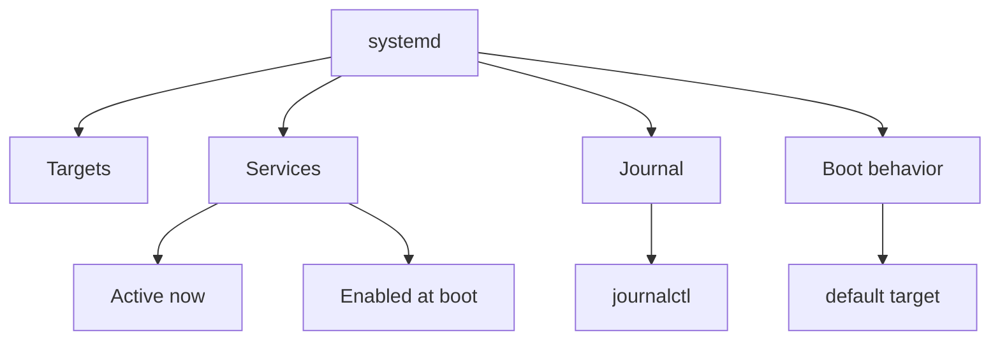

# Boot, Targets, Processes, Logs, and Tuning

> Teach you how to boot and shut down systems safely, work with systemd targets, manage processes, inspect logs, preserve journals, and use tuning profiles.

## At a Glance

**Why this matters for RHCSA**

These are direct RHCSA objectives and are central to real administration. You must understand how the system starts, how services and processes behave, and how to read evidence from logs.

**Real-world use**

Admins reboot systems for maintenance, isolate broken services, kill runaway processes, review journals for failures, and tune systems for different workloads.

**Estimated study time**

6 hours

## Prerequisites

- Read `01-shell-basics-and-command-syntax.md`
- Read `03-redirection-pipes-grep-and-regex.md`

## Objectives Covered

- Boot, reboot, and shut down a system normally
- Boot systems into different targets manually
- Interrupt the boot process to gain access to a system
- Identify CPU and memory intensive processes and kill processes
- Adjust process scheduling
- Manage tuning profiles
- Locate and interpret system log files and journals
- Preserve system journals
- Start, stop, and check the status of network services

## Commands/Tools Used

`systemctl`, `reboot`, `shutdown`, `ps`, `top`, `kill`, `pkill`, `nice`, `renice`, `journalctl`, `tuned-adm`, `free`, `uptime`, `loginctl`

## Offline Help References For This Topic

- `man systemctl`
- `man journalctl`
- `man ps`
- `man top`
- `man kill`
- `man nice`
- `man renice`
- `man tuned-adm`

## Common Beginner Mistakes

- Rebooting without checking for persistent configuration
- Killing the wrong process because PID was not verified
- Looking only at running state, not enabled state
- Reading logs without narrowing by service or time
- Changing runtime behavior but not making it persistent

## Concept Explanation In Simple Language

Modern RHEL systems use `systemd`. It manages services, targets, boot behavior, and the system journal.



### Targets

Targets are system states.

Common examples:

- `multi-user.target`
- `graphical.target`
- `rescue.target`

### Running vs Enabled

- running: active now
- enabled: configured to start at boot

These are not the same thing.

### Processes

A process is a running program. You need to know how to inspect and control it safely.

### Logs and Journal

The journal records system and service messages. It is one of your best troubleshooting tools.

### Persistence After Reboot

For this topic, persistence matters a lot:

- default target should survive reboot
- enabled services should return after reboot
- persistent journal storage should still exist after reboot
- tuning profile choice should remain active

### Interrupting Boot To Gain Access

This objective is about controlled recovery, not random boot experimentation.

General recovery pattern on RHEL-style systems:

1. interrupt the GRUB menu during boot
2. edit the kernel boot entry temporarily
3. boot into a recovery or emergency path
4. make the required repair
5. relabel SELinux if the repair requires it
6. reboot normally

Version-specific note:

- exact kernel arguments and recovery steps can differ by RHEL release and lab policy
- practice this only in disposable lab systems
- always verify using local help and your current system's bootloader tools

## Command Breakdowns

### Reboot and shutdown

```bash
sudo systemctl reboot
sudo systemctl poweroff
sudo shutdown -r now
```

### Check targets

```bash
systemctl get-default
sudo systemctl set-default multi-user.target
sudo systemctl isolate rescue.target
```

### Recovery boot access overview

Common temporary recovery actions may involve:

- editing the GRUB entry at boot
- booting into `rescue.target` or similar recovery mode
- using emergency shell access to repair passwords, `fstab`, or boot issues

After recovery work:

- verify file changes
- relabel if SELinux-sensitive changes were made
- reboot normally

### Process inspection

```bash
ps aux | head
top
ps -ef | grep httpd
```

### Kill processes

```bash
kill PID
kill -9 PID
pkill pattern
```

### Scheduling priority

```bash
nice -n 10 command
sudo renice 5 -p PID
```

### Logs

```bash
journalctl
journalctl -b
journalctl -u sshd
journalctl -p err -b
```

### Persistent journals

```bash
sudo mkdir -p /var/log/journal
sudo systemctl restart systemd-journald
```

### Tuning profiles

```bash
tuned-adm list
sudo tuned-adm active
sudo tuned-adm profile balanced
```

## Worked Examples

### Worked Example 1: Check Running vs Enabled State

```bash
systemctl status sshd
systemctl is-active sshd
systemctl is-enabled sshd
```

Verification:

- explain the difference between active and enabled

### Worked Example 2: Find and Stop a Busy Process

```bash
ps aux --sort=-%cpu | head
kill PID
```

Verification:

- confirm the process is gone with `ps`

### Worked Example 3: Read Logs for One Service

```bash
journalctl -u sshd -b
```

Verification:

- identify one recent event involving `sshd`

## Guided Hands-On Lab

### Lab Goal

Practice core systemd operations, process control, log reading, and persistence checks.

### Setup

Use root privileges where needed.

### Task Steps

1. Check the current default target.
2. List whether `sshd` is active and enabled.
3. Start or restart a service safely.
4. Use `journalctl -u servicename` to inspect its logs.
5. Use `ps` or `top` to identify a few processes.
6. Start a harmless test process such as `sleep 300` and find its PID.
7. Change its priority if allowed.
8. Kill the test process.
9. Enable persistent journaling if it is not already configured.
10. List tuning profiles and check the active profile.
11. Review the local documentation for your system's recovery boot workflow and write down the exact recovery steps for your lab version.

### Expected Result

You can control services and processes, inspect evidence in the journal, and understand what will persist after reboot.

### Verification Commands

```bash
systemctl get-default
systemctl is-enabled sshd
journalctl -b | tail
tuned-adm active
```

## Independent Practice Tasks

1. Reboot a non-critical lab machine safely.
2. Change the default target to `multi-user.target` and verify it.
3. Start a `sleep 500` process and kill it by PID.
4. Use `pkill` to stop a test process by name.
5. Show journal messages from the current boot only.
6. Show only error-priority log messages.
7. Enable persistent journals and verify `/var/log/journal` exists.
8. In a disposable lab, document the exact steps required to interrupt boot and enter a recovery path on your current RHEL version.

## Verification Steps

1. Verify enabled state separately from active state.
2. Verify a killed process is truly gone from `ps`.
3. Verify the default target with `systemctl get-default`.
4. Reboot and verify persistent journal storage still works if configured.
5. Verify your recovery-boot notes match the actual bootloader behavior in your lab.

## Troubleshooting Section

### Problem: Service starts now but not after reboot

Cause:

- service was started but not enabled

Fix:

```bash
sudo systemctl enable service
```

### Problem: `kill` did nothing

Cause:

- wrong PID or signal insufficient

Fix:

- verify PID again
- escalate carefully if needed

### Problem: Journal seems empty after reboot

Cause:

- persistent storage not configured

Fix:

- create `/var/log/journal` and restart journald

### Problem: system boot target change did not persist

Cause:

- used `isolate` only, not `set-default`

Fix:

- set the default target explicitly

## Common Mistakes And Recovery

- Mistake: using `kill -9` immediately.
  Recovery: try normal termination first when possible.

- Mistake: looking only at `systemctl status` and missing `is-enabled`.
  Recovery: check both running and boot behavior.

- Mistake: rebooting without a reason.
  Recovery: on exam tasks, reboot when the task requires persistence verification.

- Mistake: reading the entire journal without filters.
  Recovery: narrow by boot, unit, or priority.

## Mini Quiz

1. What is the difference between active and enabled?
2. What command shows the current default target?
3. What command shows logs for one service?
4. What command can list high-CPU processes?
5. What does `nice` affect?
6. What directory is commonly used to preserve system journals?
7. Why should boot interruption and recovery be practiced only on disposable lab systems?

## Exam-Style Tasks

### Task 1

Configure a system so its default boot target is `multi-user.target`. Verify the setting now and after reboot.

### Grader Mindset Checklist

- default target must be `multi-user.target`
- setting must persist after reboot

### Task 2

Enable persistent journaling, then prove that log storage is configured and journald is functioning.

### Grader Mindset Checklist

- `/var/log/journal` must exist
- journald should be running
- `journalctl -b` should return current boot logs
- configuration should persist after reboot

## Answer Key / Solution Guide

### Quiz Answers

1. Active means running now. Enabled means starts automatically at boot.
2. `systemctl get-default`
3. `journalctl -u service`
4. `ps aux --sort=-%cpu | head` or `top`
5. Scheduling priority
6. `/var/log/journal`
7. Because recovery boot work can make a system temporarily unbootable if done carelessly.

### Exam-Style Task 1 Example Solution

```bash
sudo systemctl set-default multi-user.target
systemctl get-default
sudo reboot
systemctl get-default
```

### Exam-Style Task 2 Example Solution

```bash
sudo mkdir -p /var/log/journal
sudo systemctl restart systemd-journald
ls -ld /var/log/journal
journalctl -b | tail
```

## Recap / Memory Anchors

- `systemctl` controls systemd
- active now is not enabled at boot
- `journalctl` is your log evidence tool
- verify PID before killing
- persistent changes should survive reboot
- `tuned-adm` manages tuning profiles

## Quick Command Summary

```bash
systemctl status service
systemctl is-active service
systemctl is-enabled service
systemctl get-default
systemctl set-default multi-user.target
systemctl isolate rescue.target
ps aux --sort=-%cpu | head
kill PID
pkill name
nice -n 10 command
renice 5 -p PID
journalctl -b
journalctl -u sshd
tuned-adm list
tuned-adm active
tuned-adm profile balanced
```