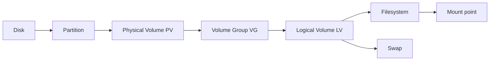

# Storage, Partitions, LVM, and Swap

> Teach you how to inspect disks, create GPT partitions, build LVM storage, and add swap space without destroying existing data.

## At a Glance

**Why this matters for RHCSA**

Storage is one of the most important RHCSA topics. You must be able to work carefully, verify every step, and understand persistence after reboot.

**Real-world use**

Admins add disks, create logical volumes for applications, extend storage, and configure swap to support system stability.

**Estimated study time**

8 hours

## Prerequisites

- Read `01-shell-basics-and-command-syntax.md`
- Read `02-files-directories-and-text-editing.md`

## Objectives Covered

- List, create, and delete partitions on MBR and GPT disks
- Create and remove physical volumes
- Assign physical volumes to volume groups
- Create and delete logical volumes
- Add swap to a system non-destructively
- Prepare storage for persistent mounting later

## Commands/Tools Used

`lsblk`, `blkid`, `parted`, `fdisk`, `partprobe`, `pvcreate`, `pvs`, `vgcreate`, `vgs`, `lvcreate`, `lvs`, `lvremove`, `vgremove`, `pvremove`, `mkswap`, `swapon`, `swapoff`, `free`

## Offline Help References For This Topic

- `man lsblk`
- `man parted`
- `man pvcreate`
- `man vgcreate`
- `man lvcreate`
- `man mkswap`
- `man swapon`

## Common Beginner Mistakes

- Editing the wrong disk
- Forgetting to inspect the current layout before changes
- Creating a filesystem or swap on the wrong device
- Removing LVM objects in the wrong order
- Making storage changes but forgetting persistent mount or swap configuration

## Concept Explanation In Simple Language

A disk can contain partitions. LVM adds flexibility on top of block devices.



Basic storage stack:

1. disk
2. partition or whole device
3. physical volume (`PV`)
4. volume group (`VG`)
5. logical volume (`LV`)
6. filesystem or swap

### Why LVM Matters

LVM makes storage easier to resize and manage than fixed plain partitions alone.

### Safe Workflow

For storage tasks, slow down. A good sequence is:

1. inspect devices
2. confirm target disk
3. create partition if needed
4. build PV, VG, LV in order
5. create filesystem or swap
6. verify
7. configure persistence where needed

## Command Breakdowns

### Inspect block devices

```bash
lsblk
blkid
```

### Create a GPT partition with `parted`

`parted` works on **GPT** (the modern default). You can run it interactively:

```bash
sudo parted /dev/vdb
```

Common interactive steps:

- `mklabel gpt`
- `mkpart primary 1MiB 1GiB`
- `set 1 lvm on` to flag partition 1 for LVM
- `rm 1` to delete partition 1 when practicing on a disposable lab disk
- `print`
- `quit`

Or do it non-interactively with `--script`, which is faster and exam-friendly:

```bash
sudo parted --script /dev/vdb mklabel gpt
sudo parted --script /dev/vdb mkpart primary 1MiB 1025MiB
sudo parted --script /dev/vdb set 1 lvm on
sudo parted /dev/vdb print
```

After creating partitions, force the kernel to re-read the partition table so the new device node (e.g. `/dev/vdb1`) appears. Without this, `pvcreate` may fail with "device not found":

```bash
sudo partprobe /dev/vdb
lsblk
```

### Create an MBR partition with `fdisk`

The objective covers **MBR and GPT**. For an MBR (DOS) layout, `fdisk` is the standard tool:

```bash
sudo fdisk /dev/vdb
```

Inside `fdisk`, the key single-letter commands are:

- `o` create a new empty **DOS/MBR** partition table (or `g` for GPT)
- `n` new partition (accept defaults, or give start/size like `+1G`)
- `t` change the partition type code (`8e` = Linux LVM, `82` = Linux swap)
- `p` print the table
- `w` write changes and exit (`q` quits without saving)

`fdisk` writes and re-reads the table on `w`, but run `sudo partprobe` afterward if the new node does not appear.

### Create LVM objects

```bash
sudo pvcreate /dev/vdb1
sudo vgcreate vgdata /dev/vdb1
sudo lvcreate -n lvdata -L 500M vgdata
```

Sizing logical volumes — exam tasks phrase size in three ways:

```bash
sudo lvcreate -n lvdata -L 500M vgdata        # absolute size (megabytes)
sudo lvcreate -n lvdata -l 50 vgdata          # 50 physical extents (-l, lowercase)
sudo lvcreate -n lvdata -l 100%FREE vgdata    # all remaining free space in the VG
```

- `-L` (capital) takes a size like `500M` or `2G`.
- `-l` (lowercase) takes a number of **extents**, or a percentage such as `100%FREE`. A task that says "use all remaining space" means `-l 100%FREE`; one that says "use 50 extents" means `-l 50`.

### Remove LVM objects safely

Delete in reverse order:

```bash
sudo lvremove /dev/vgdata/lvdata
sudo vgremove vgdata
sudo pvremove /dev/vdb1
```

### Inspect LVM

```bash
pvs
vgs
lvs
```

### Create swap

```bash
sudo mkswap /dev/vdb2
sudo swapon /dev/vdb2
free -h
```

### Remove swap safely

```bash
sudo swapoff /dev/vdb2
```

## Worked Examples

### Worked Example 1: Inspect Disks Safely

```bash
lsblk
blkid
```

Verification:

- identify which device is new and unused before making changes

### Worked Example 2: Build a Small LVM Stack

```bash
sudo pvcreate /dev/vdb1
sudo vgcreate vgexam /dev/vdb1
sudo lvcreate -n lvexam -L 256M vgexam
sudo lvs
```

Verification:

- `lvs` should show the new logical volume

### Worked Example 3: Create and Activate Swap

```bash
sudo mkswap /dev/vdb2
sudo swapon /dev/vdb2
swapon --show
free -h
```

Verification:

- swap should appear in `swapon --show`

### Worked Example 4: Remove a Throwaway LVM Lab Stack

```bash
sudo lvremove /dev/vgexam/lvexam
sudo vgremove vgexam
sudo pvremove /dev/vdb1
```

Verification:

- `lvs`, `vgs`, and `pvs` should no longer show the removed lab objects

## Guided Hands-On Lab

### Lab Goal

Practice a complete safe storage workflow using an extra lab disk.

### Setup

You need an unused disk such as `/dev/vdb`. Never practice on a disk that contains important data.

### Task Steps

1. Identify the extra disk with `lsblk`.
2. Open it with `parted`.
3. Create a GPT label if the disk is empty.
4. Create one partition for LVM (set the `lvm` flag) and one partition for swap.
5. Run `sudo partprobe` and verify the partitions appear in `lsblk`.
6. Create a PV on the LVM partition.
7. Create a VG named `vgdata`.
8. Create an LV named `lvfiles`.
9. Create swap on the second partition and activate it.
10. Inspect all layers with `lsblk`, `pvs`, `vgs`, `lvs`, and `swapon --show`.

### Expected Result

You can identify storage devices, create partitions safely, build an LVM layout, and add swap space without touching the wrong disk.

### Verification Commands

```bash
lsblk
pvs
vgs
lvs
swapon --show
free -h
```

## Independent Practice Tasks

1. List current block devices and explain what each major device is used for.
2. Create a new GPT partition on a spare disk.
3. Turn one spare partition into a PV.
4. Add that PV to a new or existing VG.
5. Create a 200M LV.
6. Activate a swap device and verify it.
7. Remove an LV, then remove the VG and PV in the correct order in a throwaway lab setup.

## Verification Steps

1. Verify device names carefully before creation or deletion.
2. Verify each layer with the matching command: `pvs`, `vgs`, `lvs`.
3. Verify swap with both `swapon --show` and `free -h`.
4. If later mounted or configured in `/etc/fstab`, verify persistence after reboot.
5. When removing lab storage, verify each layer is gone in reverse order.

## Troubleshooting Section

### Problem: `Device or resource busy`

Cause:

- device is mounted, active as swap, or in use by LVM

Fix:

- unmount or deactivate before removing

### Problem: `pvcreate` fails

Cause:

- wrong device, missing partition table update, or device already in use

Fix:

- check `lsblk`, `blkid`, and partprobe if needed

### Problem: swap activates now but not after reboot

Cause:

- no persistent entry configured

Fix:

- add correct UUID entry to `/etc/fstab` later and verify after reboot

### Problem: wrong size calculations

Cause:

- MB and MiB confusion or typing error

Fix:

- inspect the actual result with `lsblk` and `lvs`

## Common Mistakes And Recovery

- Mistake: forgetting to note the target disk name.
  Recovery: inspect before every destructive step.

- Mistake: creating a filesystem on the whole disk instead of the intended partition or LV.
  Recovery: stop and verify device names before proceeding further.

- Mistake: removing VG before LV.
  Recovery: delete in reverse dependency order: LV, then VG, then PV.

- Mistake: not verifying active swap.
  Recovery: check with `swapon --show`.

## Mini Quiz

1. What is the order from PV to VG to LV?
2. What command shows logical volumes?
3. What command activates a swap device now?
4. What command shows current swap usage?
5. Why is `lsblk` important before storage changes?
6. Why are storage tasks especially dangerous if rushed?
7. In what order should you remove LV, VG, and PV objects?
8. Which command re-reads the partition table so a new partition node appears?
9. How do you create a logical volume that uses all remaining free space in a volume group?
10. Which tool creates an MBR partition, and what type code marks a partition as Linux LVM?

## Exam-Style Tasks

### Task 1

On an unused disk, create a GPT partition for LVM, create a volume group named `vgexam`, and create a logical volume named `lvexam` of the size requested by your lab scenario.

### Grader Mindset Checklist

- correct disk and partition must exist
- PV, VG, and LV must exist
- names and sizes must match the task

### Task 2

Add a new swap area on an unused partition, activate it, and prepare to make it persistent later through `/etc/fstab`.

### Grader Mindset Checklist

- swap signature must exist
- swap must be active now
- UUID should be identifiable for persistent configuration
- must still work after reboot once persistence is configured

## Answer Key / Solution Guide

### Quiz Answers

1. Physical volume, then volume group, then logical volume.
2. `lvs`
3. `swapon`
4. `free -h` or `swapon --show`
5. It shows actual device layout so you do not edit the wrong disk.
6. Because the wrong command can destroy data.
7. Remove the LV first, then the VG, then the PV.
8. `partprobe` (run `sudo partprobe /dev/vdb`).
9. `sudo lvcreate -n NAME -l 100%FREE VGNAME`.
10. `fdisk` creates MBR partitions; type code `8e` marks Linux LVM (`82` marks swap).

### Exam-Style Task 1 Example Solution

```bash
lsblk
sudo parted --script /dev/vdb mklabel gpt
sudo parted --script /dev/vdb mkpart primary 1MiB 1025MiB
sudo parted --script /dev/vdb set 1 lvm on
sudo partprobe /dev/vdb
sudo pvcreate /dev/vdb1
sudo vgcreate vgexam /dev/vdb1
sudo lvcreate -n lvexam -L 512M vgexam
sudo lvs
```

### Exam-Style Task 2 Example Solution

```bash
sudo mkswap /dev/vdb2
sudo swapon /dev/vdb2
swapon --show
blkid /dev/vdb2
```

## Recap / Memory Anchors

- inspect first with `lsblk`
- partitions live on disks (`parted` for GPT, `fdisk` for MBR)
- run `partprobe` after partitioning so the new node appears
- LVM stack is PV then VG then LV
- `-L` is a size, `-l` is extents or `100%FREE`
- swap uses `mkswap` and `swapon`
- verify every layer separately
- persistence later depends on correct `/etc/fstab` entries

## Quick Command Summary

```bash
lsblk
blkid
parted --script /dev/vdb mklabel gpt
parted --script /dev/vdb mkpart primary 1MiB 1025MiB
parted --script /dev/vdb set 1 lvm on
partprobe /dev/vdb
fdisk /dev/vdb            # alternative, for MBR layouts
pvcreate /dev/vdb1
vgcreate vgdata /dev/vdb1
lvcreate -n lvdata -L 500M vgdata
lvcreate -n lvall -l 100%FREE vgdata
pvs
vgs
lvs
mkswap /dev/vdb2
swapon /dev/vdb2
swapoff /dev/vdb2
free -h
```