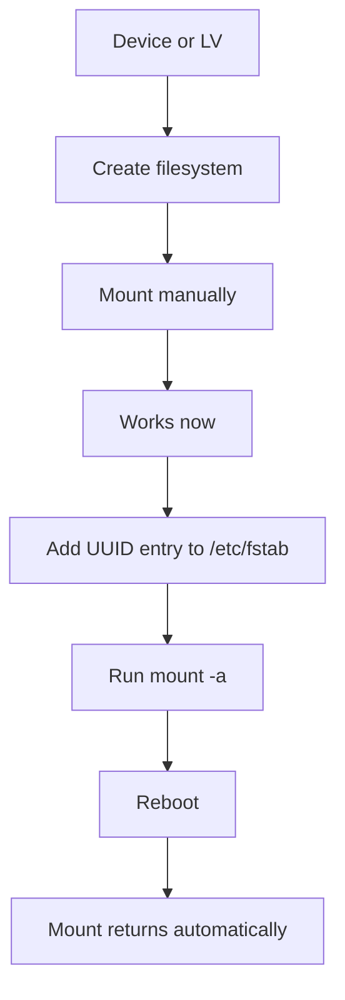
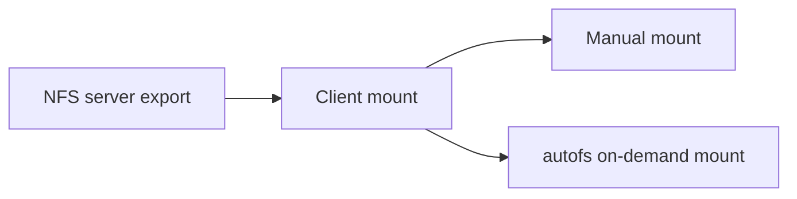

# Filesystems, Mounts, NFS, and Autofs

> Teach you how to create filesystems, mount and unmount storage, configure persistent mounts, work with NFS, and use autofs.

## At a Glance

**Why this matters for RHCSA**

Mounting storage correctly and making it survive reboot is a major RHCSA skill. NFS and autofs are also explicit objectives.

**Real-world use**

Admins mount local storage, add application volumes, expose shared data with NFS, and use automounting so remote filesystems appear only when needed.

**Estimated study time**

8 hours

## Prerequisites

- Read `10-storage-partitions-lvm-and-swap.md`
- Read `02-files-directories-and-text-editing.md`

## Objectives Covered

- Create, mount, unmount, and use VFAT, ext4, and XFS filesystems
- Configure systems to mount filesystems at boot by UUID or label
- Mount and unmount network filesystems using NFS
- Configure autofs
- Extend existing logical volumes
- Diagnose and correct file permission problems

## Commands/Tools Used

`mkfs.xfs`, `mkfs.ext4`, `mkfs.vfat`, `mount`, `umount`, `findmnt`, `blkid`, `lsblk`, `xfs_growfs`, `resize2fs`, `exportfs`, `showmount`, `autofs`, `systemctl`

## Offline Help References For This Topic

- `man mount`
- `man umount`
- `man fstab`
- `man mkfs.xfs`
- `man mkfs.ext4`
- `man exports`
- `man autofs`
- `man auto.master`

## Common Beginner Mistakes

- Formatting the wrong device
- Mounting successfully now but forgetting `/etc/fstab`
- Using device names instead of UUID or label for persistence
- Editing `/etc/fstab` and not testing it safely
- Forgetting to create the mount point directory
- Configuring NFS but not verifying exports or firewall access

## Concept Explanation In Simple Language

A filesystem organizes data on a storage device. A mount makes that filesystem accessible at a directory path.





### Mount Points

A mount point is just a directory where another filesystem becomes visible.

### Persistence

Manual mount:

- works now
- disappears after reboot

Persistent mount:

- defined in `/etc/fstab`
- returns after reboot if configured correctly

### Safe `/etc/fstab` Rule

After editing `/etc/fstab`, always test before reboot:

```bash
sudo mount -a
```

If this command reports errors, fix them before rebooting.

### NFS and Autofs

NFS shares directories over the network.

Autofs mounts them on demand when you access a path.

## Command Breakdowns

### Create filesystems

```bash
sudo mkfs.xfs /dev/vgdata/lvfiles
sudo mkfs.ext4 /dev/vdb1
sudo mkfs.vfat /dev/vdb2
```

### Mount and unmount

```bash
sudo mount /dev/vgdata/lvfiles /data
sudo umount /data
findmnt /data
```

### Identify UUID and label

```bash
blkid
lsblk -f
```

### Extend logical volume and filesystem

```bash
sudo lvextend -L +200M /dev/vgdata/lvfiles
sudo xfs_growfs /data
```

For ext4:

```bash
sudo resize2fs /dev/vgdata/lvfiles
```

### NFS export basics

```bash
sudo systemctl enable --now nfs-server
sudo exportfs -rav
showmount -e servera
```

### Autofs basics

Common files:

- `/etc/auto.master`
- map file such as `/etc/auto.misc` or a custom map

## Worked Examples

### Worked Example 1: Make and Mount an XFS Filesystem

```bash
sudo mkfs.xfs /dev/vgdata/lvfiles
sudo mkdir -p /data
sudo mount /dev/vgdata/lvfiles /data
findmnt /data
```

Verification:

- `findmnt /data` should show the mounted filesystem

### Worked Example 2: Add a Persistent Mount by UUID

```bash
blkid /dev/vgdata/lvfiles
echo 'UUID=example-uuid /data xfs defaults 0 0' | sudo tee -a /etc/fstab
sudo mount -a
findmnt /data
```

Verification:

- `mount -a` should succeed with no error

### Worked Example 3: Inspect NFS Exports

```bash
showmount -e servera
```

Verification:

- exported paths should be listed if the server is configured correctly

## Guided Hands-On Lab

### Lab Goal

Create filesystems, mount them safely, make them persistent, and practice NFS/autofs.

### Setup

Use a spare LV or spare partition. Never format a device that contains important data.

### Task Steps

1. Identify the target device with `lsblk`.
2. Create an XFS or ext4 filesystem on the target.
3. Create mount point `/mnt/labdata`.
4. Mount the filesystem manually.
5. Verify with `findmnt` and `df -h`.
6. Record the filesystem UUID.
7. Add a correct `/etc/fstab` entry using UUID.
8. Unmount the filesystem.
9. Run `mount -a` to test the fstab entry.
10. Reboot and verify it mounts automatically.
11. If two systems are available, configure a simple NFS export on one and mount it on the other.
12. If supported in your lab, configure autofs for an NFS path and verify on-demand mounting.

### Expected Result

You can move from raw device to usable, persistent mounted filesystem, and you understand how remote mounts are verified.

### Verification Commands

```bash
findmnt /mnt/labdata
grep labdata /etc/fstab
mount -a
showmount -e servera
systemctl status autofs
```

## Independent Practice Tasks

1. Create an ext4 filesystem on a spare device.
2. Mount it at `/srv/demo`.
3. Use `blkid` to find its UUID.
4. Add a persistent mount entry and test with `mount -a`.
5. Extend an LV and grow the filesystem.
6. Configure a basic NFS export on one host.
7. Mount that export from another host.
8. Configure autofs to mount an NFS export on demand.

## Verification Steps

1. Verify the correct filesystem type with `lsblk -f` or `blkid`.
2. Verify current mounts with `findmnt`.
3. Verify `/etc/fstab` works with `mount -a` before reboot.
4. Reboot and verify the mount returns automatically.
5. Verify NFS export visibility with `showmount -e`.

## Troubleshooting Section

### Problem: `wrong fs type, bad option, bad superblock`

Cause:

- wrong filesystem type, wrong device, or damaged filesystem

Fix:

- verify the actual filesystem type with `lsblk -f`

### Problem: system fails to mount after reboot

Cause:

- bad `/etc/fstab` entry

Fix:

- boot to rescue if needed
- inspect `/etc/fstab`
- test with `mount -a` before reboot next time

### Problem: NFS share not mounting

Cause:

- export missing, firewall blocking, service not running, or wrong path

Fix:

- check `systemctl status nfs-server`
- check `exportfs -v`
- check `showmount -e server`

### Problem: autofs path does not trigger mount

Cause:

- map file syntax or service not running

Fix:

- review `auto.master` and map file
- restart and check `autofs`

## Common Mistakes And Recovery

- Mistake: using `/dev/vdb1` directly in `/etc/fstab` instead of UUID.
  Recovery: prefer UUID or label for persistence.

- Mistake: forgetting the mount point directory.
  Recovery: create it before mounting.

- Mistake: editing `/etc/fstab` and rebooting immediately.
  Recovery: always run `mount -a` first.

- Mistake: growing the LV but not the filesystem.
  Recovery: extend both the block layer and the filesystem.

## Mini Quiz

1. What file controls normal persistent mounts at boot?
2. Why is UUID usually safer than `/dev/vdb1` in `/etc/fstab`?
3. What command tests `/etc/fstab` entries without rebooting?
4. What command shows current mounts clearly?
5. What does autofs do?
6. Which command shows NFS exports from a server?

## Exam-Style Tasks

### Task 1

Create a filesystem on the specified device or LV, mount it at `/data`, and configure it to mount automatically at boot using UUID. Verify before and after reboot.

### Grader Mindset Checklist

- filesystem must exist
- mount point must exist
- `/etc/fstab` entry must be correct
- `mount -a` should succeed
- mount must return automatically after reboot

### Task 2

Configure an NFS share or client mount according to your lab scenario, and if requested configure autofs for on-demand access.

### Grader Mindset Checklist

- export or client mount must exist as required
- service state must be correct
- remote access must work
- if autofs is used, on-demand mount behavior must function
- configuration must persist after reboot

## Answer Key / Solution Guide

### Quiz Answers

1. `/etc/fstab`
2. Device names may change; UUID is more stable.
3. `mount -a`
4. `findmnt`
5. It mounts filesystems automatically when accessed.
6. `showmount -e server`

### Exam-Style Task 1 Example Solution

```bash
sudo mkfs.xfs /dev/vgdata/lvfiles
sudo mkdir -p /data
sudo mount /dev/vgdata/lvfiles /data
blkid /dev/vgdata/lvfiles
sudo vi /etc/fstab
sudo mount -a
findmnt /data
sudo reboot
findmnt /data
```

### Exam-Style Task 2 Example Solution

```bash
sudo systemctl enable --now nfs-server
sudo vi /etc/exports
sudo exportfs -rav
showmount -e localhost
sudo systemctl enable --now autofs
```

## Recap / Memory Anchors

- filesystem first, mount second
- manual mount is temporary
- `/etc/fstab` makes it persistent
- test with `mount -a`
- reboot to verify
- NFS shares network storage
- autofs mounts on demand

## Quick Command Summary

```bash
mkfs.xfs /dev/device
mkfs.ext4 /dev/device
mkfs.vfat /dev/device
mount /dev/device /mountpoint
umount /mountpoint
findmnt /mountpoint
blkid
lsblk -f
lvextend -L +200M /dev/vg/lv
xfs_growfs /mountpoint
resize2fs /dev/vg/lv
showmount -e server
exportfs -rav
systemctl enable --now autofs
mount -a
```