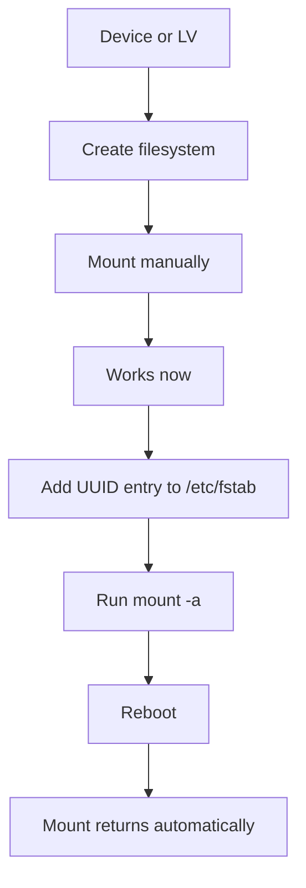
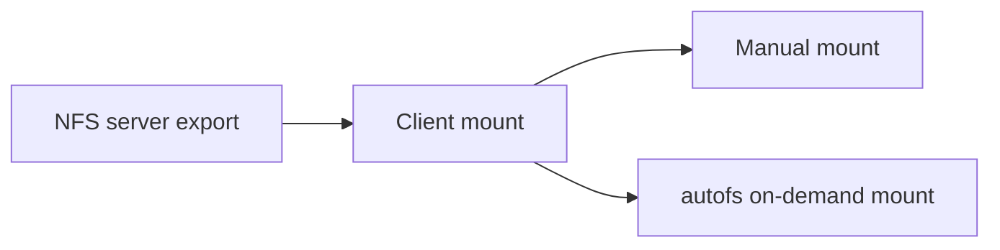

# Filesystems, Mounts, NFS, and Autofs

> Teach you how to create filesystems, mount and unmount storage, configure persistent mounts, work with NFS, and use autofs.

## At a Glance

**Why this matters for RHCSA**

Mounting storage correctly and making it survive reboot is a major RHCSA skill. NFS and autofs are also explicit objectives.

**Real-world use**

Admins mount local storage, add application volumes, expose shared data with NFS, and use automounting so remote filesystems appear only when needed.

**Estimated study time**

8 hours

## Prerequisites

- Read `10-storage-partitions-lvm-and-swap.md`
- Read `02-files-directories-and-text-editing.md`

## Objectives Covered

- Create, mount, unmount, and use VFAT, ext4, and XFS filesystems
- Configure systems to mount filesystems at boot by UUID or label
- Mount and unmount network filesystems using NFS
- Configure autofs
- Extend existing logical volumes
- Diagnose and correct file permission problems

## Commands/Tools Used

`mkfs.xfs`, `mkfs.ext4`, `mkfs.vfat`, `mount`, `umount`, `findmnt`, `blkid`, `lsblk`, `lvextend`, `xfs_growfs`, `resize2fs`, `mount -t nfs`, `showmount`, `autofs`, `systemctl`, `systemctl daemon-reload`

## Offline Help References For This Topic

- `man mount`
- `man umount`
- `man fstab`
- `man mkfs.xfs`
- `man mkfs.ext4`
- `man nfs`
- `man autofs`
- `man auto.master`
- `man 5 autofs`

## Common Beginner Mistakes

- Formatting the wrong device
- Mounting successfully now but forgetting `/etc/fstab`
- Using device names instead of UUID or label for persistence
- Editing `/etc/fstab` and not testing it safely
- Forgetting to create the mount point directory
- Forgetting `systemctl daemon-reload` after editing `/etc/fstab`
- Mounting an NFS share but leaving out `_netdev` in `/etc/fstab`

## Concept Explanation In Simple Language

A filesystem organizes data on a storage device. A mount makes that filesystem accessible at a directory path.





### Mount Points

A mount point is just a directory where another filesystem becomes visible.

### Persistence

Manual mount:

- works now
- disappears after reboot

Persistent mount:

- defined in `/etc/fstab`
- returns after reboot if configured correctly

### Safe `/etc/fstab` Rule

After editing `/etc/fstab`, reload the systemd mount units and then test, before reboot:

```bash
sudo systemctl daemon-reload
sudo mount -a
```

On RHEL, systemd turns `/etc/fstab` lines into mount units at boot. If you change `/etc/fstab` while the system is running, `systemctl daemon-reload` makes systemd re-read it; `mount -a` then mounts everything not already mounted. If `mount -a` reports errors, fix them before rebooting — a bad `/etc/fstab` entry can stop the next boot.

### NFS and Autofs (client side)

On the RHCSA exam you are the **NFS client**: a server already exports a directory, and your job is to **mount** it — manually, persistently in `/etc/fstab`, or on demand with autofs. Setting up an NFS *server* (`/etc/exports`, `exportfs`) is RHCE-level and not required here; this lesson stays on the client side.

- NFS makes a directory on a remote server appear at a local path.
- Autofs mounts an NFS path automatically the moment you access it, and unmounts it after idle time.
- The client package is `nfs-utils`; `showmount -e SERVER` lists what a server offers.

## Command Breakdowns

### Create filesystems

```bash
sudo mkfs.xfs /dev/vgdata/lvfiles
sudo mkfs.ext4 /dev/vdb1
sudo mkfs.vfat /dev/vdb2
```

### Mount and unmount

```bash
sudo mount /dev/vgdata/lvfiles /data
sudo umount /data
findmnt /data
```

### Identify UUID and label

```bash
blkid
lsblk -f
```

### Extend a logical volume and grow its filesystem

Growing storage is always two steps: enlarge the LV (block layer), then grow the filesystem on top of it. The filesystem tool depends on the filesystem type.

For an **XFS** filesystem (grows online; `xfs_growfs` takes the mount point):

```bash
sudo lvextend -L +200M /dev/vgdata/lvxfs
sudo xfs_growfs /xfsdata
```

For an **ext4** filesystem (`resize2fs` takes the device):

```bash
sudo lvextend -L +200M /dev/vgdata/lvext4
sudo resize2fs /dev/vgdata/lvext4
```

Or do both steps in one command with `-r` (`--resizefs`), which calls the right grow tool for you regardless of filesystem type:

```bash
sudo lvextend -r -L +200M /dev/vgdata/lvfiles
```

- XFS can only **grow**, never shrink. `resize2fs` (ext4) can grow and shrink.
- `lvextend -r` is the safest exam habit because you cannot forget the filesystem step.

### NFS client mount

Mount an export from a remote server. The client package is usually already present; install it if not:

```bash
sudo dnf install -y nfs-utils
showmount -e servera                       # see what servera exports
sudo mkdir -p /mnt/nfsdata
sudo mount -t nfs servera:/export/data /mnt/nfsdata
findmnt /mnt/nfsdata
```

To make an NFS mount persistent, add it to `/etc/fstab` with the `_netdev` option so the system waits for the network:

```text
servera:/export/data  /mnt/nfsdata  nfs  _netdev,defaults  0 0
```

Then `sudo systemctl daemon-reload` and `sudo mount -a` to test.

### Autofs (on-demand) map

Autofs uses a master map that points to per-directory maps. On RHEL, add your own master entry as a drop-in under `/etc/auto.master.d/` ending in `.autofs`.

`/etc/auto.master.d/nfsdata.autofs` — names the base directory and the map file:

```text
/mnt/auto   /etc/auto.nfsdata
```

`/etc/auto.nfsdata` — an **indirect** map: key, options, then `server:/path`:

```text
data   -rw   servera:/export/data
```

Accessing `/mnt/auto/data` now triggers the mount automatically. Enable the service:

```bash
sudo dnf install -y autofs
sudo systemctl enable --now autofs
ls /mnt/auto/data        # accessing the path triggers the mount
findmnt /mnt/auto/data
```

## Worked Examples

### Worked Example 1: Make and Mount an XFS Filesystem

```bash
sudo mkfs.xfs /dev/vgdata/lvfiles
sudo mkdir -p /data
sudo mount /dev/vgdata/lvfiles /data
findmnt /data
```

Verification:

- `findmnt /data` should show the mounted filesystem

### Worked Example 2: Add a Persistent Mount by UUID

```bash
blkid /dev/vgdata/lvfiles
# copy the real UUID into the fstab line, for example:
echo 'UUID=1234-abcd /data xfs defaults 0 0' | sudo tee -a /etc/fstab
sudo systemctl daemon-reload
sudo mount -a
findmnt /data
```

Verification:

- `mount -a` should succeed with no error
- `findmnt /data` confirms the mount is active

### Worked Example 3: Mount an NFS Export From a Client

```bash
showmount -e servera
sudo mkdir -p /mnt/nfsdata
sudo mount -t nfs servera:/export/data /mnt/nfsdata
findmnt /mnt/nfsdata
```

Verification:

- `findmnt` shows the NFS mount with type `nfs4`
- you can read the exported files under `/mnt/nfsdata`

## Guided Hands-On Lab

### Lab Goal

Create filesystems, mount them safely, make them persistent, and practice NFS/autofs.

### Setup

Use a spare LV or spare partition. Never format a device that contains important data.

### Task Steps

1. Identify the target device with `lsblk`.
2. Create an XFS or ext4 filesystem on the target.
3. Create mount point `/mnt/labdata`.
4. Mount the filesystem manually.
5. Verify with `findmnt` and `df -h`.
6. Record the filesystem UUID.
7. Add a correct `/etc/fstab` entry using UUID.
8. Unmount the filesystem.
9. Run `sudo systemctl daemon-reload` then `mount -a` to test the fstab entry.
10. Reboot and verify it mounts automatically.
11. Extend the LV by 200M and grow the filesystem (use `lvextend -r`), then confirm the new size with `df -h`.
12. If an NFS server is available, mount one of its exports with `mount -t nfs` and verify with `findmnt`.
13. If supported in your lab, configure autofs (master drop-in + indirect map) for an NFS path and verify on-demand mounting.

### Expected Result

You can move from raw device to usable, persistent mounted filesystem, and you understand how remote mounts are verified.

### Verification Commands

```bash
findmnt /mnt/labdata
grep labdata /etc/fstab
sudo systemctl daemon-reload
mount -a
df -h /mnt/labdata
findmnt /mnt/nfsdata
systemctl status autofs
```

## Independent Practice Tasks

1. Create an ext4 filesystem on a spare device.
2. Mount it at `/srv/demo`.
3. Use `blkid` to find its UUID.
4. Add a persistent mount entry and test with `mount -a`.
5. Extend an LV and grow the filesystem (try both the two-step way and `lvextend -r`).
6. From a client, list a server's exports with `showmount -e`.
7. Mount an NFS export with `mount -t nfs` and make it persistent with `_netdev`.
8. Configure autofs (master drop-in + indirect map) to mount an NFS export on demand.

## Verification Steps

1. Verify the correct filesystem type with `lsblk -f` or `blkid`.
2. Verify current mounts with `findmnt`.
3. Verify `/etc/fstab` works with `mount -a` before reboot.
4. Reboot and verify the mount returns automatically.
5. Verify NFS export visibility with `showmount -e`.

## Troubleshooting Section

### Problem: `wrong fs type, bad option, bad superblock`

Cause:

- wrong filesystem type, wrong device, or damaged filesystem

Fix:

- verify the actual filesystem type with `lsblk -f`

### Problem: system fails to mount after reboot

Cause:

- bad `/etc/fstab` entry

Fix:

- boot to rescue if needed
- inspect `/etc/fstab`
- test with `mount -a` before reboot next time

### Problem: NFS share not mounting (client side)

Cause:

- wrong server or export path, `nfs-utils` not installed, network down, or the server's firewall blocking

Fix:

- confirm what the server offers with `showmount -e SERVER`
- confirm the mount point directory exists
- test a manual `sudo mount -t nfs SERVER:/path /mnt/point` before adding to fstab
- if it works manually but not at boot, check for the `_netdev` option in `/etc/fstab`

### Problem: autofs path does not trigger mount

Cause:

- map file syntax, wrong paths, or the service not running

Fix:

- review the `/etc/auto.master.d/*.autofs` drop-in and the indirect map file
- run `sudo systemctl restart autofs` after editing maps
- check `systemctl status autofs` and try accessing the full path again

## Common Mistakes And Recovery

- Mistake: using `/dev/vdb1` directly in `/etc/fstab` instead of UUID.
  Recovery: prefer UUID or label for persistence.

- Mistake: forgetting the mount point directory.
  Recovery: create it before mounting.

- Mistake: editing `/etc/fstab` and rebooting immediately.
  Recovery: always run `mount -a` first.

- Mistake: growing the LV but not the filesystem.
  Recovery: extend both the block layer and the filesystem.

## Mini Quiz

1. What file controls normal persistent mounts at boot?
2. Why is UUID usually safer than `/dev/vdb1` in `/etc/fstab`?
3. What command tests `/etc/fstab` entries without rebooting?
4. What command shows current mounts clearly?
5. What does autofs do?
6. Which command shows NFS exports from a server?
7. Why run `systemctl daemon-reload` after editing `/etc/fstab`?
8. Which `/etc/fstab` option should an NFS line include so the system waits for the network?
9. What single `lvextend` option extends the LV and grows the filesystem together?

## Exam-Style Tasks

### Task 1

Create a filesystem on the specified device or LV, mount it at `/data`, and configure it to mount automatically at boot using UUID. Verify before and after reboot.

### Grader Mindset Checklist

- filesystem must exist
- mount point must exist
- `/etc/fstab` entry must be correct
- `mount -a` should succeed
- mount must return automatically after reboot

### Task 2

Configure an NFS share or client mount according to your lab scenario, and if requested configure autofs for on-demand access.

### Grader Mindset Checklist

- export or client mount must exist as required
- service state must be correct
- remote access must work
- if autofs is used, on-demand mount behavior must function
- configuration must persist after reboot

## Answer Key / Solution Guide

### Quiz Answers

1. `/etc/fstab`
2. Device names may change; UUID is more stable.
3. `mount -a`
4. `findmnt`
5. It mounts filesystems automatically when accessed.
6. `showmount -e server`
7. So systemd re-reads `/etc/fstab` and regenerates its mount units; otherwise a running system may not see the change.
8. `_netdev`
9. `lvextend -r` (`--resizefs`).

### Exam-Style Task 1 Example Solution

```bash
sudo mkfs.xfs /dev/vgdata/lvfiles
sudo mkdir -p /data
sudo mount /dev/vgdata/lvfiles /data
blkid /dev/vgdata/lvfiles
# add a UUID line to /etc/fstab using the value from blkid:
sudo vi /etc/fstab
# e.g.  UUID=1234-abcd  /data  xfs  defaults  0 0
sudo systemctl daemon-reload
sudo mount -a
findmnt /data
sudo reboot
findmnt /data
```

### Exam-Style Task 2 Example Solution (NFS client + autofs)

```bash
# manual / persistent client mount
sudo dnf install -y nfs-utils
showmount -e servera
sudo mkdir -p /mnt/nfsdata
sudo mount -t nfs servera:/export/data /mnt/nfsdata
findmnt /mnt/nfsdata
# persistent: add to /etc/fstab, then:
#   servera:/export/data  /mnt/nfsdata  nfs  _netdev,defaults  0 0
sudo systemctl daemon-reload
sudo mount -a

# on-demand with autofs
sudo dnf install -y autofs
echo '/mnt/auto  /etc/auto.nfsdata' | sudo tee /etc/auto.master.d/nfsdata.autofs
echo 'data  -rw  servera:/export/data' | sudo tee /etc/auto.nfsdata
sudo systemctl enable --now autofs
ls /mnt/auto/data
findmnt /mnt/auto/data
```

## Recap / Memory Anchors

- filesystem first, mount second
- manual mount is temporary
- `/etc/fstab` makes it persistent; run `daemon-reload` then `mount -a`
- NFS client lines need `_netdev`
- grow storage in two layers: `lvextend` then grow FS (or `lvextend -r`)
- reboot to verify
- RHCSA is the NFS client; autofs mounts on demand via `/etc/auto.master.d/`

## Quick Command Summary

```bash
mkfs.xfs /dev/device
mkfs.ext4 /dev/device
mkfs.vfat /dev/device
mount /dev/device /mountpoint
umount /mountpoint
findmnt /mountpoint
blkid
lsblk -f
lvextend -L +200M /dev/vg/lv
xfs_growfs /mountpoint
resize2fs /dev/vg/lv
lvextend -r -L +200M /dev/vg/lv
showmount -e server
mount -t nfs server:/export /mnt/point
systemctl daemon-reload
systemctl enable --now autofs
mount -a
```