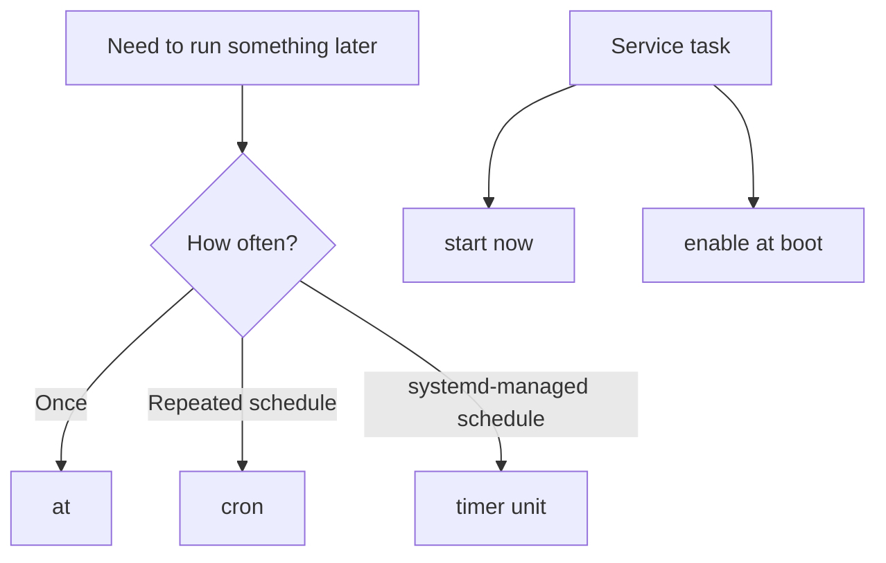

# Scheduling, Services, Time, and Bootloader

> Teach you how to schedule tasks with `at`, `cron`, and systemd timers, manage services at boot, configure time synchronization, and make controlled bootloader changes.

## At a Glance

**Why this matters for RHCSA**

These are direct exam objectives and are strongly tied to persistence. A task that works now but not later is not enough.

**Real-world use**

Admins schedule reports and maintenance jobs, ensure services start automatically, keep system clocks correct, and adjust bootloader behavior when required.

**Estimated study time**

6 hours

## Prerequisites

- Read `09-boot-targets-processes-logs-and-tuning.md`
- Read `08-shell-scripting-basics.md`

## Objectives Covered

- Schedule tasks using `at`, `cron`, and systemd timer units
- Start and stop services and configure services to start automatically at boot
- Configure systems to boot into a specific target automatically
- Configure time service clients
- Modify the system bootloader

## Commands/Tools Used

`at`, `atq`, `atrm`, `crontab`, `systemctl`, `timedatectl`, `chronyc`, `grubby`, `grub2-mkconfig` where relevant, `ls`

## Offline Help References For This Topic

- `man at`
- `man crontab`
- `man systemd.timer`
- `man timedatectl`
- `man chronyc`
- `man grubby`

## Common Beginner Mistakes

- Scheduling a job and never verifying it ran
- Editing the wrong user's crontab
- Starting a service but forgetting to enable it
- Changing boot behavior temporarily instead of persistently
- Not checking time synchronization status after configuration

## Concept Explanation In Simple Language

Scheduling tools let the system run commands later or repeatedly.



### Three Scheduling Tools

- `at`: run once at a future time
- `cron`: run repeatedly on a schedule
- systemd timer: run systemd-managed scheduled jobs

### Service Persistence

For services:

- `start` affects now
- `enable` affects boot

### Time Sync

Time matters for logs, security, scheduled jobs, and distributed systems. RHEL commonly uses `chronyd` for time synchronization.

### Bootloader Care

Bootloader changes should be made carefully and verified. On RHCSA, you should know how to inspect and adjust settings without breaking boot.

Safe bootloader habits:

1. inspect the current state first
2. record the original setting before changing it
3. make one change at a time
4. reboot only after you know how to verify the result
5. avoid unnecessary bootloader edits during the exam

## Command Breakdowns

### One-time job with `at`

```bash
echo "date > /tmp/at-test.txt" | at now + 2 minutes
atq
```

### Repeating jobs with `crontab`

```bash
crontab -e
crontab -l
```

Example cron line:

```text
*/5 * * * * date >> /tmp/cron-test.txt
```

Cron field order:

```text
minute hour day-of-month month day-of-week command
```

Example:

```text
0 2 * * * /usr/bin/date >> /tmp/nightly.txt
```

This means:

- minute `0`
- hour `2`
- every day of month
- every month
- every day of week
- run the command at `02:00`

!!! info "Exam Focus"
    For cron jobs, use full command paths when you are unsure.
    Cron runs with a smaller environment than your normal shell.

### Simple systemd timer view

```bash
systemctl list-timers
```

### Service control

```bash
sudo systemctl enable --now chronyd
sudo systemctl disable service
```

### Scheduler daemons

```bash
systemctl status crond
systemctl status atd
```

### Time sync status

```bash
timedatectl
chronyc sources
```

### Bootloader examples

```bash
sudo grubby --info=ALL
sudo grubby --default-kernel
sudo grubby --update-kernel=ALL --args="quiet"
sudo grubby --update-kernel=ALL --remove-args="quiet"
```

Exact workflows can vary by RHEL version, so verify in your lab.

## Worked Examples

### Worked Example 1: Schedule a One-Time Job

```bash
echo "hostname > /tmp/at-host.txt" | at now + 1 minute
atq
```

Verification:

- after the time passes, `/tmp/at-host.txt` should exist

### Worked Example 2: Confirm a Service Is Enabled at Boot

```bash
systemctl is-active chronyd
systemctl is-enabled chronyd
```

Verification:

- explain why both checks matter

### Worked Example 3: Inspect Time Sync State

```bash
timedatectl
chronyc tracking
```

Verification:

- identify whether NTP synchronization is active

### Worked Example 4: Read a Cron Entry Correctly

Cron line:

```text
*/10 * * * * /usr/bin/echo hello >> /tmp/cron-hello.txt
```

Verification:

- explain that the job runs every 10 minutes
- explain why `/usr/bin/echo` is safer than plain `echo` in a cron example

### Worked Example 5: Inspect Current Bootloader Defaults Safely

```bash
sudo grubby --info=ALL
sudo grubby --default-kernel
```

Verification:

- identify the current default kernel before attempting any bootloader change

## Guided Hands-On Lab

### Lab Goal

Schedule one-time and repeating tasks, verify service boot behavior, check time sync, and inspect bootloader settings safely.

### Setup

Use a lab system where scheduled test files in `/tmp` are safe.

### Task Steps

1. Schedule a one-time `at` job to create a file in `/tmp`.
2. View the queued jobs.
3. Create a user cron job that appends the date to a file every few minutes.
4. List your cron jobs.
5. View active timers with `systemctl list-timers`.
6. Check whether `crond` and `atd` are running.
7. Check whether `chronyd` is active and enabled.
8. Enable and start `chronyd` if needed.
9. Check `timedatectl` status.
10. Inspect bootloader entries with `grubby` or the version-appropriate tool in your lab.
11. If you make a bootloader change, document it and verify carefully.
12. Reboot and confirm any service or bootloader-related persistent change behaves as expected.

### Expected Result

You can schedule work in multiple ways and verify both current and persistent service behavior.

### Verification Commands

```bash
atq
crontab -l
systemctl list-timers
systemctl is-enabled chronyd
timedatectl
```

## Independent Practice Tasks

1. Create an `at` job that writes the hostname to a file.
2. Remove a queued `at` job.
3. Add a cron job and verify it appears in `crontab -l`.
4. Inspect existing systemd timers.
5. Enable a service at boot and verify it.
6. Check time synchronization state.
7. Inspect the current bootloader settings.
8. Add and then remove a harmless kernel argument in a disposable lab, documenting the before and after state.

## Verification Steps

1. Verify one-time jobs with `atq` and result files.
2. Verify cron entries with `crontab -l`.
3. Verify service boot persistence with `systemctl is-enabled`.
4. Verify time client status with `timedatectl` and `chronyc`.
5. Reboot and verify enabled services remain enabled.
6. For any bootloader change, verify both the configured setting and the post-reboot behavior.

## Troubleshooting Section

### Problem: `at` job never ran

Cause:

- `atd` not running, wrong time, or syntax error in the job

Fix:

- verify the daemon and inspect the job queue

### Problem: cron job exists but output file is empty

Cause:

- command path issue, permissions, or environment difference

Fix:

- use full paths in cron jobs when needed

### Problem: service runs now but not after reboot

Cause:

- forgot `enable`

Fix:

- run `systemctl enable service`

### Problem: time appears wrong

Cause:

- time sync service disabled, bad source, or timezone misunderstanding

Fix:

- check `timedatectl`
- verify `chronyd`

### Problem: bootloader change had unexpected effects

Cause:

- kernel argument added to the wrong entry, wrong syntax, or change not verified before reboot

Fix:

- inspect current bootloader state again
- remove the bad argument if possible
- keep a record of the original setting before retrying

## Common Mistakes And Recovery

- Mistake: assuming schedule tools share the same syntax.
  Recovery: treat `at`, `cron`, and timers as separate tools.

- Mistake: editing root's cron when you meant your own user cron.
  Recovery: verify the active user first.

- Mistake: making a bootloader change without recording the original state.
  Recovery: inspect and note current config before changes.

- Mistake: not verifying the scheduled task output.
  Recovery: always create a visible proof file in labs.

## Mini Quiz

1. What tool runs a job one time in the future?
2. What command lists your current cron jobs?
3. What command lists active timers?
4. What is the difference between `systemctl start` and `systemctl enable`?
5. What service commonly handles time sync on RHEL systems?
6. Why should bootloader changes be verified carefully?
7. What command can show the current default kernel on systems using `grubby`?

## Exam-Style Tasks

### Task 1

Schedule a one-time job that creates `/tmp/once.txt`, and configure a recurring job that appends the date to `/tmp/repeat.txt`.

### Grader Mindset Checklist

- one-time job must be queued or completed successfully
- recurring job must exist in the correct crontab or timer configuration
- output files should appear as expected

### Task 2

Configure the time synchronization client and verify that it is enabled at boot and active now.

### Grader Mindset Checklist

- time service must be active
- time service must be enabled
- time sync status should show healthy operation
- configuration must persist after reboot

## Answer Key / Solution Guide

### Quiz Answers

1. `at`
2. `crontab -l`
3. `systemctl list-timers`
4. `start` runs now. `enable` starts at boot.
5. `chronyd`
6. Because bad changes can affect system boot.
7. `grubby --default-kernel`

### Exam-Style Task 1 Example Solution

```bash
echo "date > /tmp/once.txt" | at now + 1 minute
crontab -e
crontab -l
```

Example cron line:

```text
*/5 * * * * date >> /tmp/repeat.txt
```

### Exam-Style Task 2 Example Solution

```bash
sudo systemctl enable --now chronyd
systemctl is-active chronyd
systemctl is-enabled chronyd
timedatectl
chronyc sources
```

## Recap / Memory Anchors

- `at` once
- `cron` repeated
- timers are systemd scheduled jobs
- start now is not enable at boot
- time sync must be active and enabled
- bootloader changes require caution

## Quick Command Summary

```bash
echo "command" | at now + 5 minutes
atq
atrm JOBID
crontab -e
crontab -l
systemctl list-timers
systemctl enable --now service
timedatectl
chronyc tracking
grubby --info=ALL
```