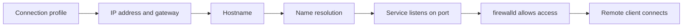

# Networking, Hostname Resolution, and firewalld

> Teach you how to configure IPv4 and IPv6 addresses, hostname resolution, network service boot behavior, and firewall access control with `firewalld`.

## At a Glance

**Why this matters for RHCSA**

Networking tasks are frequent on RHCSA and in real administration. Services that work locally but not over the network often fail because of IP, DNS, or firewall mistakes.

**Real-world use**

Admins assign addresses, troubleshoot connectivity, configure hostnames, and open only the network access a service actually needs.

**Estimated study time**

6 hours

## Prerequisites

- Read `01-shell-basics-and-command-syntax.md`
- Read `05-ssh-login-switching-users-and-remote-workflows.md`
- Read `09-boot-targets-processes-logs-and-tuning.md`

## Objectives Covered

- Configure IPv4 and IPv6 addresses
- Configure hostname resolution
- Configure network services to start automatically at boot
- Restrict network access using `firewalld` and `firewall-cmd`
- Configure firewall settings using `firewall-cmd` and `firewalld`

## Commands/Tools Used

`ip`, `nmcli`, `hostnamectl`, `ping`, `ss`, `firewall-cmd`, `systemctl`, `cat`

## Offline Help References For This Topic

- `man ip`
- `man nmcli`
- `man hostnamectl`
- `man firewalld`
- `man firewall-cmd`
- `nmcli --help`

## Common Beginner Mistakes

- Changing the wrong network connection profile
- Forgetting to bring the connection back up
- Testing only by IP and not by name
- Making a runtime firewall change but not a permanent one
- Opening the wrong service or port

## Concept Explanation In Simple Language

Network configuration has two parts:

- how your system reaches the network
- which incoming network access is allowed



### Runtime vs Permanent Firewall

With `firewalld`:

- runtime changes affect now
- permanent changes survive reload and reboot

For RHCSA, you must understand both and usually make the change permanent.

### Connection Profile vs Device Name (read this first)

`nmcli` configures **connection profiles**, not interfaces directly. The profile name and the device (interface) name are often different, and this is the single most common networking mistake on the exam.

- The **device** is the hardware/kernel name: `ens160`, `enp1s0`, `eth0`, etc. See it with `nmcli device status` or `ip addr`.
- The **connection profile** is what NetworkManager stores config in. It may be named after the device (`ens160`) or something else like `System ens160` or `Wired connection 1`. See it with `nmcli connection show`.

**Always look up the real profile name before modifying it.** Never assume it is `eth0`. Throughout this lesson the examples use a shell variable so you copy the correct name once:

```bash
nmcli connection show          # find the NAME in the first column
CON="System ens160"            # set CON to YOUR profile name (quote it if it has spaces)
```

### Hostname Resolution

Name lookup may use:

- `/etc/hosts`
- DNS servers

On RHEL, `/etc/resolv.conf` is managed by NetworkManager — set DNS through the connection profile (`ipv4.dns`), do not hand-edit `/etc/resolv.conf`. In lab work, `/etc/hosts` is often enough for simple hostname resolution.

## Command Breakdowns

### Show addresses and find the profile name

```bash
ip addr
ip route
nmcli device status        # device (interface) names + state
nmcli connection show      # connection PROFILE names
```

### Configure an IPv4 connection with `nmcli`

First capture the real profile name, then modify it. `+ipv4.addresses`/`+ipv4.dns` add values; `ipv4.method manual` switches off DHCP:

```bash
CON="System ens160"        # replace with YOUR profile name from nmcli connection show
sudo nmcli connection modify "$CON" ipv4.addresses 192.168.122.50/24
sudo nmcli connection modify "$CON" ipv4.gateway 192.168.122.1
sudo nmcli connection modify "$CON" ipv4.dns 192.168.122.1
sudo nmcli connection modify "$CON" ipv4.method manual
sudo nmcli connection up "$CON"
```

### Configure an IPv6 address

The objective covers IPv6 too. The keys mirror IPv4 with the `ipv6.` prefix:

```bash
sudo nmcli connection modify "$CON" ipv6.addresses 2001:db8:0:1::50/64
sudo nmcli connection modify "$CON" ipv6.gateway 2001:db8:0:1::1
sudo nmcli connection modify "$CON" ipv6.method manual
sudo nmcli connection up "$CON"
ip -6 addr
```

After any change, re-activate the profile with `nmcli connection up "$CON"` so it takes effect, and verify with `ip addr`.

### Hostname

```bash
sudo hostnamectl set-hostname servera.example.com
hostnamectl
```

### Firewall

```bash
sudo firewall-cmd --get-active-zones
sudo firewall-cmd --add-service=http
sudo firewall-cmd --add-service=http --permanent
sudo firewall-cmd --reload
sudo firewall-cmd --list-all
```

### Open a port directly

```bash
sudo firewall-cmd --add-port=8080/tcp --permanent
sudo firewall-cmd --reload
```

## Worked Examples

### Worked Example 1: Check Current Addressing and Profile Name

```bash
ip addr
ip route
nmcli device status
nmcli connection show
```

Verification:

- identify the active interface (device) and its address
- note the connection **profile** name — you will use it, not `eth0`, in `nmcli modify`

### Worked Example 2: Set a Hostname

```bash
sudo hostnamectl set-hostname serverb.example.com
hostnamectl
```

Verification:

- hostname output should match the new value

### Worked Example 3: Open HTTP Service in the Firewall

```bash
sudo firewall-cmd --add-service=http --permanent
sudo firewall-cmd --reload
sudo firewall-cmd --list-services
```

Verification:

- `http` should appear in the allowed services list

## Guided Hands-On Lab

### Lab Goal

Inspect and modify network settings safely, configure name resolution, and make persistent firewall rules.

### Setup

Use a non-production lab system.

### Task Steps

1. List connection profiles with `nmcli connection show` and devices with `nmcli device status`.
2. Display current IPv4 and IPv6 addresses with `ip addr` and `ip -6 addr`.
3. Record the active interface name **and** the connection profile name (they may differ).
4. If your lab requires a static address, configure IPv4 (and IPv6 if asked) on the correct profile with `nmcli`.
5. Set DNS with `ipv4.dns`, bring the connection up, and verify.
6. Set the system hostname.
7. Add a hostname mapping in `/etc/hosts` if needed for your lab.
8. Check firewall state.
9. Allow a service such as `ssh` or `http` permanently.
10. Reload the firewall and verify.
11. Reboot and verify networking and firewall settings persist.

### Expected Result

You can inspect connections, change basic network settings, confirm name resolution, and make permanent firewall changes.

### Verification Commands

```bash
nmcli connection show
ip addr
hostnamectl
firewall-cmd --list-all
getent hosts servera.example.com
```

## Independent Practice Tasks

1. List active interfaces and addresses.
2. Configure a static IPv4 address on a lab interface.
3. Configure an IPv6 address if your lab supports it.
4. Set a hostname and verify it.
5. Add a host entry in `/etc/hosts`.
6. Open a firewall service permanently.
7. Open a custom TCP port permanently.
8. Reboot and verify the settings remain.

## Verification Steps

1. Verify addresses with `ip addr`.
2. Verify connection profiles with `nmcli connection show`.
3. Verify hostname resolution with `getent hosts name`.
4. Verify firewall rules with `firewall-cmd --list-all`.
5. Reboot and verify network connectivity still works.

## Troubleshooting Section

### Problem: Interface changes do not take effect

Cause:

- connection profile not reloaded or brought up

Fix:

- run `nmcli connection up name`

### Problem: Hostname resolves incorrectly

Cause:

- bad `/etc/hosts` entry or DNS issue

Fix:

- inspect `/etc/hosts`
- test with `getent hosts`

### Problem: Service still unreachable after opening firewall

Cause:

- service not running, wrong port, wrong zone, or SELinux issue

Fix:

- verify service state
- verify listening ports with `ss -tuln`
- verify firewall zone and rules

### Problem: Rule disappears after reboot

Cause:

- runtime-only change

Fix:

- use `--permanent`, then reload

## Common Mistakes And Recovery

- Mistake: editing network settings on the wrong profile.
  Recovery: identify the active profile first.

- Mistake: opening a firewall port but forgetting reload.
  Recovery: reload and verify again.

- Mistake: relying on `ping` alone for application testing.
  Recovery: test the actual service port too.

- Mistake: changing hostname without verifying name resolution.
  Recovery: check both `hostnamectl` and `getent hosts`.

## Mini Quiz

1. What command shows current IP addresses?
2. What tool commonly manages network connections on RHEL systems?
3. What command changes the system hostname?
4. What is the difference between runtime and permanent firewall rules?
5. What command reloads firewalld permanent changes into runtime?
6. What file can provide simple local hostname mappings?
7. Why should you run `nmcli connection show` before modifying a connection?
8. Which `nmcli` keys set an IPv6 address and switch it to static?
9. On RHEL, how do you set DNS servers, and why not edit `/etc/resolv.conf` directly?

## Exam-Style Tasks

### Task 1

Configure a network interface with the required address information for your lab and verify connectivity and persistence after reboot.

### Grader Mindset Checklist

- correct IP settings must be applied
- interface must be up
- settings must survive reboot
- connectivity checks should succeed

### Task 2

Allow network access to a required service using `firewall-cmd` and verify the rule now and after reboot.

### Grader Mindset Checklist

- correct service or port must be allowed
- rule must be permanent if persistence is required
- firewall reload must succeed
- access should still work after reboot

## Answer Key / Solution Guide

### Quiz Answers

1. `ip addr`
2. `nmcli`
3. `hostnamectl set-hostname`
4. Runtime affects now. Permanent survives reload and reboot.
5. `firewall-cmd --reload`
6. `/etc/hosts`
7. The connection profile name is often not the interface name (and not `eth0`); modifying the wrong name fails or has no effect.
8. `ipv6.addresses` and `ipv6.method manual` (mirror of the `ipv4.` keys).
9. Set `ipv4.dns`/`ipv6.dns` on the connection profile; `/etc/resolv.conf` is managed by NetworkManager and hand edits get overwritten.

### Exam-Style Task 1 Example Solution

```bash
nmcli connection show                       # find the real profile NAME
CON="System ens160"                          # replace with your profile name
sudo nmcli connection modify "$CON" ipv4.addresses 192.168.122.50/24
sudo nmcli connection modify "$CON" ipv4.gateway 192.168.122.1
sudo nmcli connection modify "$CON" ipv4.dns 192.168.122.1
sudo nmcli connection modify "$CON" ipv4.method manual
sudo nmcli connection up "$CON"
ip addr
sudo reboot
ip addr
```

### Exam-Style Task 2 Example Solution

```bash
sudo firewall-cmd --add-service=http --permanent
sudo firewall-cmd --reload
sudo firewall-cmd --list-all
```

## Recap / Memory Anchors

- inspect with `ip` and `nmcli`
- find the real profile name with `nmcli connection show` — it is not `eth0`
- IPv6 keys mirror IPv4 (`ipv6.addresses`, `ipv6.method`)
- set DNS via `ipv4.dns`, not by editing `/etc/resolv.conf`
- set hostname with `hostnamectl`
- use `/etc/hosts` for simple local name mapping
- firewall runtime is temporary; permanent is reboot-safe
- always verify after reload and reboot

## Quick Command Summary

```bash
ip addr
ip route
nmcli device status
nmcli connection show
nmcli connection modify "$CON" ipv4.addresses 192.168.122.50/24
nmcli connection modify "$CON" ipv4.gateway 192.168.122.1
nmcli connection modify "$CON" ipv4.dns 192.168.122.1
nmcli connection modify "$CON" ipv4.method manual
nmcli connection modify "$CON" ipv6.addresses 2001:db8:0:1::50/64
nmcli connection modify "$CON" ipv6.method manual
nmcli connection up "$CON"
hostnamectl set-hostname host.example.com
firewall-cmd --list-all
firewall-cmd --add-service=http --permanent
firewall-cmd --add-port=8080/tcp --permanent
firewall-cmd --reload
getent hosts hostname
```