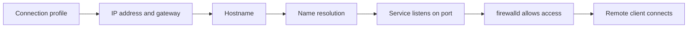

# 1. Title

Networking, Hostname Resolution, and firewalld

# 2. Purpose

Teach you how to configure IPv4 and IPv6 addresses, hostname resolution, network service boot behavior, and firewall access control with `firewalld`.

# 3. Why this matters for RHCSA

Networking tasks are frequent on RHCSA and in real administration. Services that work locally but not over the network often fail because of IP, DNS, or firewall mistakes.

# 4. Real-world use

Admins assign addresses, troubleshoot connectivity, configure hostnames, and open only the network access a service actually needs.

# 5. Prerequisites

- Read `01-shell-basics-and-command-syntax.md`
- Read `05-ssh-login-switching-users-and-remote-workflows.md`
- Read `09-boot-targets-processes-logs-and-tuning.md`

# 6. Objectives covered

- Configure IPv4 and IPv6 addresses
- Configure hostname resolution
- Configure network services to start automatically at boot
- Restrict network access using `firewalld` and `firewall-cmd`
- Configure firewall settings using `firewall-cmd` and `firewalld`

# 7. Commands/tools used

`ip`, `nmcli`, `hostnamectl`, `ping`, `ss`, `firewall-cmd`, `systemctl`, `cat`

# 8. Offline help references for this topic

- `man ip`
- `man nmcli`
- `man hostnamectl`
- `man firewalld`
- `man firewall-cmd`
- `nmcli --help`

# 9. Estimated study time

6 hours

# 10. Common beginner mistakes

- Changing the wrong network connection profile
- Forgetting to bring the connection back up
- Testing only by IP and not by name
- Making a runtime firewall change but not a permanent one
- Opening the wrong service or port

## Concept Explanation In Simple Language

Network configuration has two parts:

- how your system reaches the network
- which incoming network access is allowed



### Runtime vs Permanent Firewall

With `firewalld`:

- runtime changes affect now
- permanent changes survive reload and reboot

For RHCSA, you must understand both and usually make the change permanent.

### Hostname Resolution

Name lookup may use:

- `/etc/hosts`
- DNS servers

In lab work, `/etc/hosts` is often enough to ensure simple hostname resolution.

## Command Breakdowns

### Show addresses

```bash
ip addr
ip route
nmcli connection show
```

### Configure connection with `nmcli`

```bash
sudo nmcli connection modify eth0 ipv4.addresses 192.168.122.50/24
sudo nmcli connection modify eth0 ipv4.gateway 192.168.122.1
sudo nmcli connection modify eth0 ipv4.method manual
sudo nmcli connection up eth0
```

### Hostname

```bash
sudo hostnamectl set-hostname servera.example.com
hostnamectl
```

### Firewall

```bash
sudo firewall-cmd --get-active-zones
sudo firewall-cmd --add-service=http
sudo firewall-cmd --add-service=http --permanent
sudo firewall-cmd --reload
sudo firewall-cmd --list-all
```

### Open a port directly

```bash
sudo firewall-cmd --add-port=8080/tcp --permanent
sudo firewall-cmd --reload
```

## Worked Examples

### Worked Example 1: Check Current Addressing

```bash
ip addr
ip route
```

Verification:

- identify the active interface and its address

### Worked Example 2: Set a Hostname

```bash
sudo hostnamectl set-hostname serverb.example.com
hostnamectl
```

Verification:

- hostname output should match the new value

### Worked Example 3: Open HTTP Service in the Firewall

```bash
sudo firewall-cmd --add-service=http --permanent
sudo firewall-cmd --reload
sudo firewall-cmd --list-services
```

Verification:

- `http` should appear in the allowed services list

## Guided Hands-On Lab

### Lab Goal

Inspect and modify network settings safely, configure name resolution, and make persistent firewall rules.

### Setup

Use a non-production lab system.

### Task Steps

1. List active network connections with `nmcli`.
2. Display current IPv4 and IPv6 addresses.
3. Record the active interface name.
4. If your lab requires a static address, configure one with `nmcli`.
5. Bring the connection up and verify.
6. Set the system hostname.
7. Add a hostname mapping in `/etc/hosts` if needed for your lab.
8. Check firewall state.
9. Allow a service such as `ssh` or `http` permanently.
10. Reload the firewall and verify.
11. Reboot and verify networking and firewall settings persist.

### Expected Result

You can inspect connections, change basic network settings, confirm name resolution, and make permanent firewall changes.

### Verification Commands

```bash
nmcli connection show
ip addr
hostnamectl
firewall-cmd --list-all
getent hosts servera.example.com
```

## Independent Practice Tasks

1. List active interfaces and addresses.
2. Configure a static IPv4 address on a lab interface.
3. Configure an IPv6 address if your lab supports it.
4. Set a hostname and verify it.
5. Add a host entry in `/etc/hosts`.
6. Open a firewall service permanently.
7. Open a custom TCP port permanently.
8. Reboot and verify the settings remain.

## Verification Steps

1. Verify addresses with `ip addr`.
2. Verify connection profiles with `nmcli connection show`.
3. Verify hostname resolution with `getent hosts name`.
4. Verify firewall rules with `firewall-cmd --list-all`.
5. Reboot and verify network connectivity still works.

## Troubleshooting Section

### Problem: Interface changes do not take effect

Cause:

- connection profile not reloaded or brought up

Fix:

- run `nmcli connection up name`

### Problem: Hostname resolves incorrectly

Cause:

- bad `/etc/hosts` entry or DNS issue

Fix:

- inspect `/etc/hosts`
- test with `getent hosts`

### Problem: Service still unreachable after opening firewall

Cause:

- service not running, wrong port, wrong zone, or SELinux issue

Fix:

- verify service state
- verify listening ports with `ss -tuln`
- verify firewall zone and rules

### Problem: Rule disappears after reboot

Cause:

- runtime-only change

Fix:

- use `--permanent`, then reload

## Common Mistakes And Recovery

- Mistake: editing network settings on the wrong profile.
  Recovery: identify the active profile first.

- Mistake: opening a firewall port but forgetting reload.
  Recovery: reload and verify again.

- Mistake: relying on `ping` alone for application testing.
  Recovery: test the actual service port too.

- Mistake: changing hostname without verifying name resolution.
  Recovery: check both `hostnamectl` and `getent hosts`.

## Mini Quiz

1. What command shows current IP addresses?
2. What tool commonly manages network connections on RHEL systems?
3. What command changes the system hostname?
4. What is the difference between runtime and permanent firewall rules?
5. What command reloads firewalld permanent changes into runtime?
6. What file can provide simple local hostname mappings?

## Exam-Style Tasks

### Task 1

Configure a network interface with the required address information for your lab and verify connectivity and persistence after reboot.

### Grader Mindset Checklist

- correct IP settings must be applied
- interface must be up
- settings must survive reboot
- connectivity checks should succeed

### Task 2

Allow network access to a required service using `firewall-cmd` and verify the rule now and after reboot.

### Grader Mindset Checklist

- correct service or port must be allowed
- rule must be permanent if persistence is required
- firewall reload must succeed
- access should still work after reboot

## Answer Key / Solution Guide

### Quiz Answers

1. `ip addr`
2. `nmcli`
3. `hostnamectl set-hostname`
4. Runtime affects now. Permanent survives reload and reboot.
5. `firewall-cmd --reload`
6. `/etc/hosts`

### Exam-Style Task 1 Example Solution

```bash
nmcli connection show
sudo nmcli connection modify eth0 ipv4.addresses 192.168.122.50/24
sudo nmcli connection modify eth0 ipv4.gateway 192.168.122.1
sudo nmcli connection modify eth0 ipv4.method manual
sudo nmcli connection up eth0
ip addr
sudo reboot
ip addr
```

### Exam-Style Task 2 Example Solution

```bash
sudo firewall-cmd --add-service=http --permanent
sudo firewall-cmd --reload
sudo firewall-cmd --list-all
```

## Recap / Memory Anchors

- inspect with `ip` and `nmcli`
- set hostname with `hostnamectl`
- use `/etc/hosts` for simple local name mapping
- firewall runtime is temporary
- firewall permanent is reboot-safe
- always verify after reload and reboot

## Quick Command Summary

```bash
ip addr
ip route
nmcli connection show
nmcli connection modify name key value
nmcli connection up name
hostnamectl set-hostname host.example.com
firewall-cmd --list-all
firewall-cmd --add-service=http --permanent
firewall-cmd --add-port=8080/tcp --permanent
firewall-cmd --reload
getent hosts hostname
```
