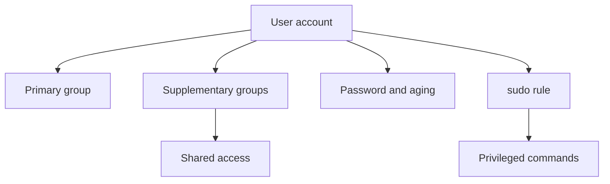

# Users, Groups, Passwords, and Sudo

> Teach you how to create, modify, and remove local users and groups, manage passwords and aging, and configure privileged access.

## At a Glance

**Why this matters for RHCSA**

User administration is a core RHCSA skill. Many other tasks depend on correct ownership, group membership, and controlled privilege use.

**Real-world use**

Admins onboard users, assign group access, expire accounts, and delegate limited administrative privileges through `sudo`.

**Estimated study time**

6 hours

## Prerequisites

- Read `01-shell-basics-and-command-syntax.md`
- Read `06-links-permissions-and-default-permissions.md`

## Objectives Covered

- Create, delete, and modify local user accounts
- Change passwords and adjust password aging
- Create, delete, and modify local groups and memberships
- Configure privileged access

## Commands/Tools Used

`useradd`, `usermod`, `userdel`, `passwd`, `chage`, `groupadd`, `groupmod`, `groupdel`, `id`, `groups`, `sudo`, `visudo`

## Offline Help References For This Topic

- `man useradd`
- `man usermod`
- `man userdel`
- `man passwd`
- `man chage`
- `man groupadd`
- `man sudoers`
- `man visudo`

## Common Beginner Mistakes

- Creating a user but forgetting its primary or supplementary groups
- Deleting a user without deciding what to do with the home directory
- Editing `sudoers` directly instead of using `visudo`
- Changing passwords without verifying account state
- Mixing group membership replacement with group membership append

## Concept Explanation In Simple Language

Users identify people or service accounts. Groups help assign shared access. `sudo` allows controlled administrative commands without using a full root shell all the time.



### Account Basics

Important user data appears in:

- `/etc/passwd`
- `/etc/shadow`
- `/etc/group`

You do not need to memorize every field immediately, but you should know where account information lives.

### Password Aging

Password aging controls:

- minimum days between password changes
- maximum days before change required
- warning days before expiration

### Privileged Access

Best practice:

- use a regular user account
- elevate privileges only when needed

## Command Breakdowns

### Create and inspect users

```bash
sudo useradd alice
id alice
```

### Create home directory and shell explicitly

```bash
sudo useradd -m -s /bin/bash bob
```

### Common `useradd` options

```bash
sudo useradd -u 1500 -c "App Service" -s /bin/bash -G wheel,developers carol
```

- `-u 1500` set a specific UID
- `-c "App Service"` set the comment/GECOS field
- `-s /bin/bash` set the login shell (`-s /sbin/nologin` for a no-login service account)
- `-G wheel,developers` add supplementary groups **at creation** time
- `-m` create the home directory (default behavior on RHEL, but explicit is safe)

System-wide defaults for new accounts come from `/etc/login.defs` (UID ranges, password aging defaults) and `/etc/default/useradd` (default shell, home base, skeleton). View the useradd defaults with:

```bash
useradd -D
```

### Set password

```bash
sudo passwd alice
```

### Lock, unlock, and expire accounts

```bash
sudo usermod -L alice          # lock the password (login disabled)
sudo usermod -U alice          # unlock the password
sudo usermod -e 2026-12-31 alice   # set account expiration date (account becomes unusable after)
sudo chage -E 2026-12-31 alice     # same expiry via chage
sudo chage -E -1 alice         # remove the expiry date (never expires)
```

- **Locking** (`usermod -L`) disables the password but keeps the account; `passwd -S alice` shows `L` when locked.
- **Expiring** (`chage -E` / `usermod -e`) disables the whole account after a date — useful for temporary/contractor accounts.

### Modify groups

```bash
sudo groupadd admins
sudo usermod -aG admins alice
groups alice
```

### Password aging

```bash
sudo chage -M 90 -m 7 -W 14 alice
sudo chage -l alice
```

### Delete user

```bash
sudo userdel alice
sudo userdel -r alice
```

### Sudo rules

```bash
sudo visudo
sudo ls /etc/sudoers.d
```

## Worked Examples

### Worked Example 1: Create a User with a Supplementary Group

```bash
sudo groupadd developers
sudo useradd -m alice
sudo usermod -aG developers alice
id alice
```

Verification:

- `developers` should appear in `id alice`

### Worked Example 2: Set Password Aging

```bash
sudo chage -M 60 -m 5 -W 7 alice
sudo chage -l alice
```

Verification:

- aging output should reflect the new policy

### Worked Example 3: Create a Temporary Account That Expires

```bash
sudo useradd -u 1600 -c "Contractor" -s /bin/bash -m temp1
sudo chage -E 2026-12-31 temp1
sudo chage -l temp1
```

Verification:

- `chage -l temp1` shows "Account expires: Dec 31, 2026"
- `id temp1` shows UID 1600

### Worked Example 4: Grant Sudo Through a Drop-In File

```bash
echo '%developers ALL=(ALL) ALL' | sudo tee /etc/sudoers.d/developers
sudo visudo -c
```

Verification:

- syntax check should report success

## Guided Hands-On Lab

### Lab Goal

Create user and group accounts, manage password policy, and configure privileged access safely.

### Setup

Use root privileges.

### Task Steps

1. Create a group named `ops`.
2. Create users `anna` and `ben` with home directories.
3. Add both users to the `ops` group.
4. Set passwords for both users.
5. Verify membership with `id`.
6. Set password aging for `anna`.
7. Create a `sudoers` drop-in file granting `ops` group sudo access.
8. Validate sudoers syntax with `visudo -c`.
9. If possible, test `sudo` from one of the user accounts.
10. Delete a throwaway test account and decide whether to keep or remove its home directory.

### Expected Result

You can manage account lifecycle and grant controlled admin access without damaging sudo configuration.

### Verification Commands

```bash
id anna
groups ben
chage -l anna
visudo -c
ls /etc/sudoers.d
```

## Independent Practice Tasks

1. Create a new user with a Bash shell.
2. Create a group and add an existing user to it.
3. Change a user's comment field or shell.
4. Set and inspect password aging for a user.
5. Remove a user while keeping the home directory.
6. Remove a user and home directory in a throwaway lab case.
7. Configure a sudoers drop-in file and verify its syntax.

## Verification Steps

1. Verify users with `id` and `/etc/passwd`.
2. Verify group membership with `id` or `groups`.
3. Verify password aging with `chage -l`.
4. Verify sudoers syntax with `visudo -c`.
5. Reboot and confirm user/group configuration still exists.

## Troubleshooting Section

### Problem: User missing from expected group

Cause:

- forgot `-a` with `usermod -G`

Fix:

- use `usermod -aG group user` to append

### Problem: Sudo broken after edit

Cause:

- syntax error in sudoers

Fix:

- always use `visudo`
- validate with `visudo -c`

### Problem: Password aging not applied

Cause:

- wrong user or wrong options

Fix:

- inspect with `chage -l user`

### Problem: Home directory missing

Cause:

- user created without expected home creation settings

Fix:

- create explicitly or use correct `useradd` options

## Common Mistakes And Recovery

- Mistake: replacing a user's supplementary groups accidentally.
  Recovery: use `-aG` when appending groups.

- Mistake: editing `/etc/sudoers` with a normal editor.
  Recovery: use `visudo` or `/etc/sudoers.d` drop-ins.

- Mistake: deleting user data too quickly.
  Recovery: decide whether `userdel` or `userdel -r` fits the task.

- Mistake: creating accounts without verifying them.
  Recovery: run `id user` immediately.

## Mini Quiz

1. What command creates a user?
2. What does `usermod -aG` do?
3. What command shows password aging information?
4. What tool should you use to validate sudoers syntax?
5. What is the difference between `userdel user` and `userdel -r user`?
6. Why is `sudo` often preferred over constant root login?
7. How do you create a user with a specific UID and a supplementary group in one command?
8. What is the difference between locking an account (`usermod -L`) and expiring it (`chage -E`)?
9. Which files hold the system-wide defaults for new user accounts?

## Exam-Style Tasks

### Task 1

Create a local user and group according to your lab scenario, add the user to the required supplementary group, and configure the requested password aging values.

### Grader Mindset Checklist

- user must exist
- group must exist
- membership must be correct
- password aging values must match the task
- configuration must persist after reboot

### Task 2

Grant privileged access to a user or group using a safe sudoers configuration method, then validate the sudo configuration.

### Grader Mindset Checklist

- sudo rule must exist
- syntax check must succeed
- access rule must match the requested scope
- configuration must still work after reboot

## Answer Key / Solution Guide

### Quiz Answers

1. `useradd`
2. It appends the user to supplementary groups.
3. `chage -l username`
4. `visudo -c`
5. `-r` also removes the home directory and mail spool.
6. It limits elevated access to needed commands and improves safety.
7. `sudo useradd -u 1500 -G groupname username` (`-u` sets the UID, `-G` adds supplementary groups).
8. Locking disables the password but keeps the account; expiring disables the whole account after a date.
9. `/etc/login.defs` and `/etc/default/useradd` (view with `useradd -D`).

### Exam-Style Task 1 Example Solution

```bash
sudo groupadd appadmins
sudo useradd -m dev1
sudo usermod -aG appadmins dev1
sudo chage -M 90 -m 7 -W 14 dev1
id dev1
chage -l dev1
```

### Exam-Style Task 2 Example Solution

```bash
echo '%appadmins ALL=(ALL) ALL' | sudo tee /etc/sudoers.d/appadmins
sudo visudo -c
```

## Recap / Memory Anchors

- `useradd` creates
- `usermod` changes
- `groupadd` manages groups
- `passwd` sets passwords; `usermod -L`/`-U` lock and unlock
- `chage` manages aging; `chage -E` / `usermod -e` expire accounts
- `useradd -u` sets UID, `-G` adds groups at creation; defaults live in `/etc/login.defs`
- `visudo` protects sudo syntax
- verify every account change

## Quick Command Summary

```bash
useradd -m user
useradd -u 1500 -c "Comment" -s /bin/bash -G grp1,grp2 user
useradd -D
usermod -aG group user
usermod -L user
usermod -U user
usermod -e 2026-12-31 user
userdel user
userdel -r user
groupadd group
groupdel group
passwd user
passwd -S user
chage -l user
chage -M 90 -m 7 -W 14 user
chage -E 2026-12-31 user
id user
groups user
visudo -c
```