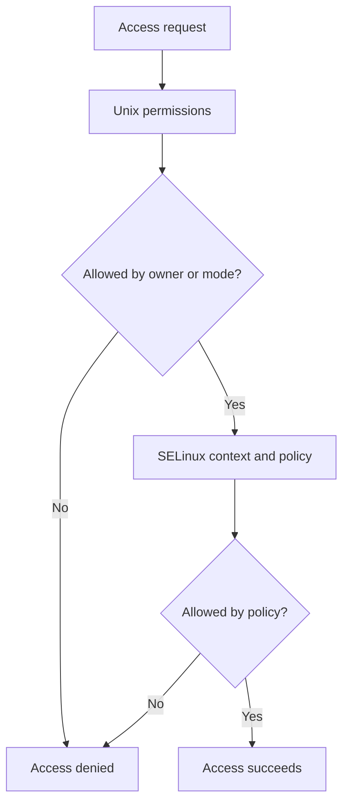
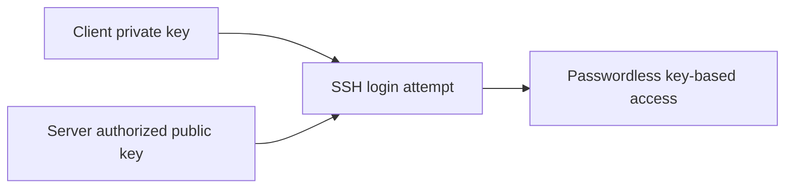

# 1. Title

SELinux, SSH Keys, and Security

# 2. Purpose

Teach you how to work with SELinux modes and contexts, restore labels, manage SELinux ports and booleans, and configure SSH key-based authentication.

# 3. Why this matters for RHCSA

SELinux and SSH key-based authentication are direct RHCSA objectives. SELinux often appears when a service seems correct but still cannot access files or ports.

# 4. Real-world use

Admins secure systems by using key-based login, least-privilege firewall rules, and SELinux policy controls instead of simply disabling security features.

# 5. Prerequisites

- Read `05-ssh-login-switching-users-and-remote-workflows.md`
- Read `06-links-permissions-and-default-permissions.md`
- Read `13-networking-hostname-resolution-and-firewalld.md`

# 6. Objectives covered

- Configure key-based authentication for SSH
- Set enforcing and permissive modes for SELinux
- List and identify SELinux file and process context
- Restore default file contexts
- Manage SELinux port labels
- Use boolean settings to modify system SELinux settings
- Configure firewall settings using `firewall-cmd` and `firewalld`
- Manage default file permissions

# 7. Commands/tools used

`getenforce`, `setenforce`, `sestatus`, `ls -Z`, `ps -eZ`, `restorecon`, `semanage`, `getsebool`, `setsebool`, `ssh-keygen`, `ssh-copy-id`, `ssh`

# 8. Offline help references for this topic

- `man selinux`
- `man getenforce`
- `man restorecon`
- `man semanage`
- `man setsebool`
- `man ssh-keygen`
- `man ssh-copy-id`

# 9. Estimated study time

8 hours

# 10. Common beginner mistakes

- Disabling SELinux instead of understanding the real issue
- Using `setenforce 0` and forgetting it is temporary
- Changing file permissions when the real problem is context
- Moving content to a non-standard path without relabeling
- Generating SSH keys but not copying the public key correctly

## Concept Explanation In Simple Language

SELinux adds an extra security layer beyond normal Unix permissions. A process may have permission by owner and mode bits, but SELinux can still deny access if the context is wrong.





### SELinux Modes

- enforcing: SELinux rules are applied
- permissive: violations are logged but not enforced
- disabled: SELinux off

For RHCSA, learn to work with SELinux, not around it.

### File and Process Contexts

Contexts label files and processes. You can inspect them and restore expected labels.

### SSH Keys

SSH key login uses a private key on the client and a public key installed on the server. It avoids typing passwords for every login and is a required skill.

### Persistence

- `setenforce` changes now only
- `/etc/selinux/config` controls boot behavior
- `setsebool -P` persists booleans
- SSH keys remain usable after reboot if installed correctly

## Command Breakdowns

### SELinux mode

```bash
getenforce
sestatus
sudo setenforce 0
sudo setenforce 1
```

Persistent mode file:

```bash
cat /etc/selinux/config
```

### Inspect contexts

```bash
ls -Z /var/www/html
ps -eZ | grep sshd
```

### Restore labels

```bash
sudo restorecon -Rv /var/www/html
```

### SELinux booleans

```bash
getsebool -a | grep httpd
sudo setsebool -P httpd_can_network_connect on
```

### SELinux ports

```bash
sudo semanage port -l | grep http
sudo semanage port -a -t http_port_t -p tcp 8080
sudo semanage port -d -t http_port_t -p tcp 8080
```

### SSH key workflow

```bash
ssh-keygen
ssh-copy-id student@serverb
ssh student@serverb
```

## Worked Examples

### Worked Example 1: Check Current SELinux State

```bash
getenforce
sestatus
```

Verification:

- explain whether the system is enforcing or permissive

### Worked Example 2: Restore Context on a Web Directory

```bash
sudo restorecon -Rv /var/www/html
ls -Z /var/www/html
```

Verification:

- labels should return to default expected types

### Worked Example 3: Generate and Install an SSH Key

```bash
ssh-keygen
ssh-copy-id student@serverb
ssh student@serverb
```

Verification:

- login should work with the key if configured properly

### Worked Example 4: Make SELinux Mode Persistent Across Boot

```bash
getenforce
cat /etc/selinux/config
```

Verification:

- confirm you understand the difference between the current runtime mode and the mode configured for the next boot

## Guided Hands-On Lab

### Lab Goal

Use SELinux tools to inspect and fix contexts, and configure SSH key-based authentication.

### Setup

You need root privileges and ideally two systems for SSH key testing.

### Task Steps

1. Check SELinux mode with `getenforce` and `sestatus`.
2. Inspect file contexts on a standard service path such as `/var/www/html` or `/var/ftp`.
3. Inspect process contexts with `ps -eZ`.
4. If a file is moved into a service directory, run `restorecon` on it.
5. List SELinux booleans relevant to a service.
6. Change one boolean persistently in a lab-safe scenario if needed.
7. List SELinux ports and inspect service-related labels.
8. Inspect `/etc/selinux/config` and note the configured boot mode.
9. Generate an SSH key pair for your user.
10. Copy the public key to another host with `ssh-copy-id`.
11. Test key-based SSH login.
12. Reboot and verify key login and SELinux boolean persistence if you changed one.

### Expected Result

You can recognize common SELinux state and label problems, and you can use key-based SSH authentication confidently.

### Verification Commands

```bash
getenforce
ls -Z /var/www/html
getsebool -a | head
ssh -o PreferredAuthentications=publickey student@serverb hostname
```

## Independent Practice Tasks

1. Show SELinux mode and full status.
2. List contexts on a service directory.
3. List contexts of running processes.
4. Restore contexts on a directory tree.
5. List SELinux booleans for `httpd` or another service.
6. Add or inspect an SELinux port label in a throwaway lab case.
7. Generate an SSH key and use it to log in to a second host.
8. Compare the runtime SELinux mode to the configured boot-time SELinux mode.

## Verification Steps

1. Verify SELinux mode with both `getenforce` and `sestatus`.
2. Verify labels with `ls -Z` and `ps -eZ`.
3. Verify `restorecon` changed labels where expected.
4. Verify persistent booleans with `getsebool`.
5. Verify `/etc/selinux/config` matches the intended boot-time SELinux mode.
6. Reboot and verify key login and any SELinux persistent changes still work.

## Troubleshooting Section

### Problem: Service still denied after permissions were fixed

Cause:

- SELinux context or boolean issue

Fix:

- inspect labels and relevant booleans

### Problem: `setenforce 0` fixed the issue temporarily

Cause:

- confirms SELinux is involved but does not solve the root cause

Fix:

- restore correct contexts, booleans, or port labels

### Problem: SSH key login still asks for password

Cause:

- key not copied, wrong permissions, wrong user, or server SSH settings

Fix:

- verify `~/.ssh` permissions and authorized key placement

### Problem: `semanage` not found

Cause:

- policy management tools package missing

Fix:

- install the required SELinux utilities package if available in your lab

## Common Mistakes And Recovery

- Mistake: disabling SELinux as the first reaction.
  Recovery: investigate contexts, booleans, and ports first.

- Mistake: using temporary boolean changes when persistence is required.
  Recovery: add `-P` for persistent boolean changes.

- Mistake: copying private keys instead of public keys.
  Recovery: only install the `.pub` key on the server.

- Mistake: trusting normal file permissions alone.
  Recovery: check both Unix permissions and SELinux context.

## Mini Quiz

1. What are the common SELinux modes?
2. What command shows SELinux mode quickly?
3. What command restores default file contexts?
4. What option makes `setsebool` persistent?
5. What command generates an SSH key pair?
6. Why might a correct file permission still not allow service access?
7. Which file controls SELinux mode at boot?

## Exam-Style Tasks

### Task 1

Configure SSH key-based authentication for a user between two hosts and verify passwordless login using the key.

### Grader Mindset Checklist

- key pair must exist
- public key must be installed for the target user
- SSH login with public key should succeed
- setup must still work after reboot

### Task 2

Fix an SELinux-related access problem using the correct SELinux tool, not by disabling SELinux. Verify the change and, if applicable, make it persistent.

### Grader Mindset Checklist

- SELinux should remain usable
- correct context, boolean, or port label must be applied
- target service or access should work
- persistent change should survive reboot where relevant

## Answer Key / Solution Guide

### Quiz Answers

1. Enforcing, permissive, and disabled.
2. `getenforce`
3. `restorecon`
4. `-P`
5. `ssh-keygen`
6. Because SELinux may deny access based on context or policy.
7. `/etc/selinux/config`

### Exam-Style Task 1 Example Solution

```bash
ssh-keygen
ssh-copy-id student@serverb
ssh student@serverb hostname
```

### Exam-Style Task 2 Example Solution

```bash
ls -Z /var/www/html
sudo restorecon -Rv /var/www/html
getsebool -a | grep httpd
sudo setsebool -P httpd_can_network_connect on
```

## Recap / Memory Anchors

- SELinux adds another access layer
- `getenforce` checks mode
- `restorecon` fixes default labels
- `setsebool -P` persists booleans
- `semanage` manages ports and more
- SSH keys use private client key plus public server key

## Quick Command Summary

```bash
getenforce
sestatus
setenforce 0
setenforce 1
ls -Z path
ps -eZ
restorecon -Rv path
getsebool -a
setsebool -P boolean on
semanage port -l
ssh-keygen
ssh-copy-id user@host
ssh user@host
```
