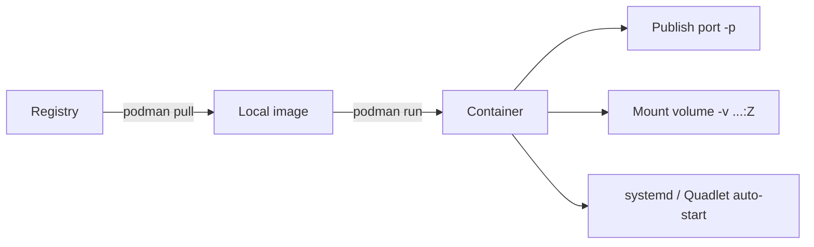

# Containers With Podman

> Teach you how to find, run, manage, and persist containers with `podman`, and how to make a container start automatically as a systemd service.

## At a Glance

**Why this matters for RHCSA**

Containers are an RHCSA objective. You must be able to pull an image, run a service in a container, give it persistent storage, and make it start on its own through systemd — all from the command line.

**Real-world use**

Admins package and run services in containers for isolation and easy deployment. On RHEL, `podman` runs containers without a background daemon and can run them as a normal (rootless) user.

**Estimated study time**

6 hours

## Prerequisites

- Read `09-boot-targets-processes-logs-and-tuning.md` (systemd services)
- Read `11-filesystems-mounts-nfs-and-autofs.md` (mounts and storage ideas)
- Read `15-selinux-ssh-keys-and-security.md` (SELinux volume labels)

## Objectives Covered

- Find and retrieve container images from a registry
- Inspect container images
- Perform basic container management: run, start, stop, list, remove
- Run a service inside a container and publish its port
- Attach persistent storage to a container
- Configure a container to start automatically as a systemd service

## Commands/Tools Used

`podman`, `podman images`, `podman pull`, `podman search`, `podman run`, `podman ps`, `podman exec`, `podman logs`, `podman stop`, `podman rm`, `podman inspect`, `skopeo`, `systemctl --user`, `loginctl`

## Offline Help References For This Topic

- `man podman`
- `man podman-run`
- `man podman-pull`
- `man podman-systemd.unit` (Quadlet `.container` files)
- `man containers.conf`
- `podman --help`, `podman run --help`

## Common Beginner Mistakes

- Trying to pull from the internet on the exam instead of the provided registry
- Forgetting `:Z` on a bind-mounted volume, so SELinux blocks the container
- Running as root when the task asks for a rootless (user) container
- Forgetting `loginctl enable-linger` so a rootless service stops at logout
- Editing a Quadlet file but not running `systemctl daemon-reload`

## Concept Explanation In Simple Language

A **container image** is a packaged, read-only filesystem plus metadata for a program. A **container** is a running (or stopped) instance of an image. `podman` is the RHEL tool to manage both — it is command-compatible with `docker` but needs no daemon and can run as a normal user.



### Rootless vs Rootful

- **Rootless**: you run `podman` as a normal user. Containers run with your privileges — safer, and the RHCSA default unless told otherwise. Rootless containers cannot publish ports below 1024 by default, so use a high host port like `8080`.
- **Rootful**: you run `podman` with `sudo`. Use only when a task explicitly needs it.

### Images and Registries

- Images live in **registries** such as `registry.access.redhat.com` or `quay.io`.
- `podman pull` downloads an image; `podman images` lists local ones.
- On the exam there is **no internet** — you pull from a **registry the exam provides** (often configured in `/etc/containers/registries.conf`), or the image is already present locally.

### Persistent Storage

Containers are disposable; their internal changes vanish when removed. To keep data, **bind-mount a host directory** into the container with `-v /host/path:/container/path:Z`. The `:Z` tells SELinux to relabel the host directory so the container can use it.

### Auto-Start With systemd

The modern way to auto-start a container is a **Quadlet** file: a small `.container` unit that systemd turns into a service.

- Rootful: `/etc/containers/systemd/NAME.container`, managed with `systemctl`.
- Rootless: `~/.config/containers/systemd/NAME.container`, managed with `systemctl --user`, plus `loginctl enable-linger USER` so it runs without an active login.

## Command Breakdowns

### Find and pull images

```bash
podman search ubi9              # search configured registries (needs a registry)
podman pull registry.access.redhat.com/ubi9/ubi
podman images                   # list local images
skopeo inspect docker://registry.access.redhat.com/ubi9/ubi   # inspect without pulling
```

### Run and manage containers

```bash
podman run -d --name web -p 8080:80 quay.io/httpd/httpd-24   # run detached, publish port
podman ps                       # running containers
podman ps -a                    # all containers, including stopped
podman logs web                 # container output
podman exec -it web /bin/bash   # shell inside the container
podman stop web
podman start web
podman rm web                   # remove a stopped container
podman inspect web              # full JSON details
```

### Run a one-off command

```bash
podman run --rm registry.access.redhat.com/ubi9/ubi cat /etc/os-release
```

`--rm` deletes the container as soon as it exits — good for quick checks.

### Persistent storage with a volume

```bash
mkdir -p ~/webcontent
echo "hello from a container" > ~/webcontent/index.html
podman run -d --name web -p 8080:80 \
  -v ~/webcontent:/var/www/html:Z \
  quay.io/httpd/httpd-24
curl http://localhost:8080
```

The `:Z` relabels `~/webcontent` for SELinux. Without it, the container often shows "Permission denied".

### Auto-start a rootless container with Quadlet

Create `~/.config/containers/systemd/web.container`:

```ini
[Unit]
Description=Web container

[Container]
Image=quay.io/httpd/httpd-24
PublishPort=8080:80
Volume=%h/webcontent:/var/www/html:Z

[Install]
WantedBy=default.target
```

Then:

```bash
loginctl enable-linger $USER          # let user services run without an active login
systemctl --user daemon-reload        # turn the .container file into a service
systemctl --user start web.service    # the service name = file name
systemctl --user status web.service
```

`%h` expands to your home directory. The unit file name (`web.container`) produces the service `web.service`.

## Worked Examples

### Worked Example 1: Pull and Inspect an Image

```bash
podman pull registry.access.redhat.com/ubi9/ubi
podman images
skopeo inspect docker://registry.access.redhat.com/ubi9/ubi | head
```

Verification:

- `podman images` lists the `ubi9/ubi` image with a size and tag

### Worked Example 2: Run a Service and Publish a Port

```bash
podman run -d --name web -p 8080:80 quay.io/httpd/httpd-24
podman ps
curl http://localhost:8080
ss -tuln | grep 8080
```

Verification:

- `podman ps` shows `web` running
- `curl` returns the web server's default page

### Worked Example 3: Attach Persistent Storage

```bash
mkdir -p ~/webcontent
echo "RHCSA container test" > ~/webcontent/index.html
podman rm -f web 2>/dev/null
podman run -d --name web -p 8080:80 -v ~/webcontent:/var/www/html:Z quay.io/httpd/httpd-24
curl http://localhost:8080
```

Verification:

- `curl` returns "RHCSA container test", proving the host file is served from inside the container

### Worked Example 4: Make the Container Start at Boot (Rootless)

```bash
mkdir -p ~/.config/containers/systemd
# create web.container as shown in the breakdown above
loginctl enable-linger $USER
systemctl --user daemon-reload
systemctl --user start web.service
systemctl --user status web.service
```

Verification:

- `systemctl --user status web.service` shows active (running)
- after a reboot, `podman ps` shows the container back up without you starting it

## Guided Hands-On Lab

### Lab Goal

Pull an image, run a service container with persistent storage, and make it auto-start through systemd as a rootless user.

### Setup

Use a normal (non-root) user. Confirm `podman` is installed:

```bash
podman --version
```

### Task Steps

1. List local images with `podman images`.
2. Pull a small image (for example `ubi9/ubi`) from the configured registry.
3. Run a one-off container that prints `/etc/os-release`, using `--rm`.
4. Create `~/webcontent/index.html` with a line of text.
5. Run a detached web container named `web`, publishing host port `8080`, with `~/webcontent` mounted at `/var/www/html:Z`.
6. Verify it serves your file with `curl http://localhost:8080`.
7. Check logs with `podman logs web` and inspect it with `podman inspect web`.
8. Create a Quadlet `~/.config/containers/systemd/web.container` describing the same container.
9. Remove the manually-run `web` container so the name is free.
10. Run `loginctl enable-linger $USER`, `systemctl --user daemon-reload`, then start `web.service`.
11. Verify with `systemctl --user status web.service` and `curl`.
12. Reboot and confirm the container comes back automatically.

### Expected Result

You can move from image to running service to auto-starting systemd-managed container, with data persisted on the host.

### Verification Commands

```bash
podman images
podman ps
curl http://localhost:8080
systemctl --user status web.service
loginctl show-user "$USER" | grep Linger
```

## Independent Practice Tasks

1. Pull an image and confirm it appears in `podman images`.
2. Run a detached named container and publish a port.
3. Exec into the container and read a file inside it.
4. Bind-mount a host directory with `:Z` and serve a file from it.
5. Stop, start, and remove a container, checking state with `podman ps -a`.
6. Write a Quadlet `.container` file and start it with `systemctl --user`.
7. Enable linger and confirm a rootless container survives a reboot.

## Verification Steps

1. Verify images with `podman images`.
2. Verify running state with `podman ps` and all state with `podman ps -a`.
3. Verify the published port with `curl` and `ss -tuln`.
4. Verify persistent data by reading the host directory and the served content.
5. Verify auto-start with `systemctl --user status NAME.service` and a reboot test.

## Troubleshooting Section

### Problem: `podman pull` fails or times out

Cause:

- no internet, or the registry is not configured

Fix:

- on the exam use the provided registry; check `/etc/containers/registries.conf`
- the image may already be local — check `podman images`

### Problem: container shows "Permission denied" reading a mounted volume

Cause:

- SELinux is blocking access because the host directory is not relabeled

Fix:

- add `:Z` to the volume option (`-v /path:/ctr/path:Z`)
- verify with `ls -Z` on the host directory

### Problem: rootless container does not start after reboot

Cause:

- linger not enabled, so user services stop when you log out

Fix:

- run `loginctl enable-linger $USER`
- confirm with `loginctl show-user "$USER" | grep Linger`

### Problem: Quadlet service not found

Cause:

- file in the wrong directory or `daemon-reload` not run

Fix:

- rootless path is `~/.config/containers/systemd/NAME.container`
- run `systemctl --user daemon-reload`, then use service name `NAME.service`

## Common Mistakes And Recovery

- Mistake: using a host port below 1024 for a rootless container.
  Recovery: use a high port such as `8080`.

- Mistake: forgetting `:Z` on a volume.
  Recovery: re-run with `:Z`, or run `restorecon` after labeling.

- Mistake: editing a Quadlet file and expecting it to take effect immediately.
  Recovery: run `systemctl --user daemon-reload` first.

- Mistake: starting a rootless service but not enabling linger.
  Recovery: `loginctl enable-linger $USER`.

## Mini Quiz

1. What is the difference between a container image and a container?
2. Which command pulls an image, and which lists local images?
3. Why use a high host port like 8080 for a rootless container?
4. What does `:Z` do on a `-v` volume mount?
5. Where does a rootless Quadlet `.container` file go, and how do you start it?
6. What does `loginctl enable-linger` do and why is it needed?
7. How do you run a single command in a container and have it removed afterward?

## Exam-Style Tasks

### Task 1

Run a detached web container named `website` from the provided registry, publish it on host port `8080`, and serve content from a host directory you create. Verify with `curl`.

### Grader Mindset Checklist

- container must be running and named `website`
- host port `8080` must reach the container
- a host directory must be mounted with the correct SELinux relabel (`:Z`)
- `curl http://localhost:8080` must return your content

### Task 2

Configure the `website` container to start automatically as a rootless systemd service that survives logout and reboot.

### Grader Mindset Checklist

- a Quadlet `.container` file exists under `~/.config/containers/systemd/`
- the user service is active (`systemctl --user status`)
- linger is enabled for the user
- the container is running again after a reboot

## Answer Key / Solution Guide

### Quiz Answers

1. An image is the packaged read-only template; a container is a running or stopped instance of it.
2. `podman pull` pulls; `podman images` lists local images.
3. Rootless containers cannot bind privileged ports below 1024 by default.
4. It relabels the host directory's SELinux context so the container can access it (private relabel).
5. `~/.config/containers/systemd/NAME.container`; run `systemctl --user daemon-reload` then `systemctl --user start NAME.service`.
6. It lets a user's systemd services keep running without an active login session, so rootless containers survive logout/reboot.
7. `podman run --rm IMAGE COMMAND`.

### Exam-Style Task 1 Example Solution

```bash
mkdir -p ~/webcontent
echo "exam content" > ~/webcontent/index.html
podman run -d --name website -p 8080:80 -v ~/webcontent:/var/www/html:Z quay.io/httpd/httpd-24
podman ps
curl http://localhost:8080
```

### Exam-Style Task 2 Example Solution

```bash
mkdir -p ~/.config/containers/systemd
cat > ~/.config/containers/systemd/website.container <<'EOF'
[Unit]
Description=Website container

[Container]
Image=quay.io/httpd/httpd-24
PublishPort=8080:80
Volume=%h/webcontent:/var/www/html:Z

[Install]
WantedBy=default.target
EOF

podman rm -f website
loginctl enable-linger "$USER"
systemctl --user daemon-reload
systemctl --user start website.service
systemctl --user status website.service
curl http://localhost:8080
```

## Recap / Memory Anchors

- image = template, container = running instance
- `podman pull` then `podman run -d --name NAME -p 8080:80 IMAGE`
- inspect with `podman ps`, `podman logs`, `podman inspect`
- persist data with `-v /host:/ctr:Z` (the `:Z` is for SELinux)
- rootless uses high ports and `systemctl --user`
- auto-start = Quadlet `.container` + `daemon-reload` + `enable-linger`
- on the exam, pull from the provided registry, not the internet

## Quick Command Summary

```bash
podman images
podman pull registry.access.redhat.com/ubi9/ubi
podman run --rm IMAGE COMMAND
podman run -d --name web -p 8080:80 -v ~/webcontent:/var/www/html:Z quay.io/httpd/httpd-24
podman ps
podman ps -a
podman logs web
podman exec -it web /bin/bash
podman stop web
podman start web
podman rm web
podman inspect web
# rootless auto-start (Quadlet):
#   ~/.config/containers/systemd/web.container
loginctl enable-linger "$USER"
systemctl --user daemon-reload
systemctl --user start web.service
```
