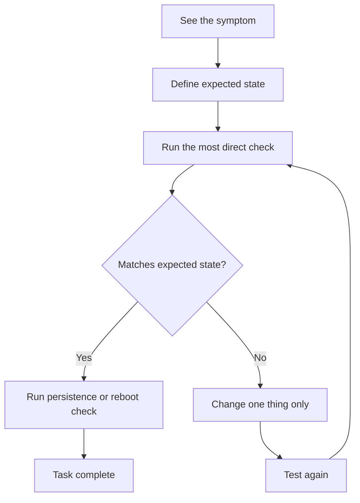

# Persistence, Reboot Checks, and Troubleshooting

> Teach you how to prove a task is truly complete, how to check whether it survives reboot, and how to troubleshoot RHCSA-style failures systematically.

## At a Glance

**Why this matters for RHCSA**

Red Hat states that configurations must persist after reboot without intervention. Many students can make things work once. Fewer can prove the system still works after restart.

**Real-world use**

Real administrators are trusted because their fixes remain stable. Temporary success without persistence is unreliable operations.

**Estimated study time**

5 hours

## Prerequisites

- Read lessons `00` through `15`

## Objectives Covered

- Persistence after reboot across all configuration topics
- Troubleshooting file, service, network, storage, and security problems
- Exam-style self-verification habits

## Commands/Tools Used

`systemctl`, `findmnt`, `mount -a`, `lsblk`, `blkid`, `ip`, `nmcli`, `firewall-cmd`, `getenforce`, `restorecon`, `journalctl`, `ss`, `id`, `reboot`

## Offline Help References For This Topic

- `man systemctl`
- `man fstab`
- `man journalctl`
- `man firewall-cmd`
- `man nmcli`
- `man restorecon`
- `apropos service`

## Common Beginner Mistakes

- Declaring a task done after one successful command
- Rebooting without a test plan
- Changing several things at once while troubleshooting
- Ignoring logs and guessing
- Forgetting whether the issue is current-state or boot-state

## Concept Explanation In Simple Language

A configuration is only complete when:

1. the target state exists now
2. the related commands work now
3. the state survives reboot if persistence is required
4. you can explain how you verified it



### A Simple Troubleshooting Loop

1. Define the exact symptom.
2. Identify the expected state.
3. Check the most direct evidence.
4. Change one thing.
5. Test again.

### Reboot Categories

Ask which category the task belongs to:

- file exists only now
- service runs only now
- service runs now and at boot
- mount works now
- mount works now and at boot
- firewall works now
- firewall works now and after reboot

## Command Breakdowns

### Service persistence

```bash
systemctl is-active httpd
systemctl is-enabled httpd
```

### Mount persistence

```bash
findmnt /data
grep /data /etc/fstab
mount -a
```

### Network persistence

```bash
nmcli connection show
ip addr
firewall-cmd --list-all
```

### SELinux verification

```bash
getenforce
ls -Z /var/www/html
```

### Journal review

```bash
journalctl -b -p err
journalctl -u sshd
```

## Worked Examples

### Worked Example 1: Service Works Now but Not at Boot

Symptoms:

- web service responds now
- after reboot it is down

Checks:

```bash
systemctl is-active httpd
systemctl is-enabled httpd
```

Fix:

```bash
sudo systemctl enable httpd
```

Verification:

- reboot and recheck active and enabled state

### Worked Example 2: Mount Works Manually but Not After Reboot

Checks:

```bash
findmnt /data
grep /data /etc/fstab
mount -a
```

Likely issue:

- missing or wrong `/etc/fstab` entry

Verification:

- reboot and confirm with `findmnt /data`

### Worked Example 3: Service Blocked by Firewall or SELinux

Checks:

```bash
ss -tuln
firewall-cmd --list-all
getenforce
journalctl -u httpd -b
```

Verification:

- prove whether the problem is the service, firewall, or SELinux rather than guessing

## Guided Hands-On Lab

### Lab Goal

Practice using verification checklists and reboot-safe testing on several types of configuration.

### Setup

Choose one service, one mount, and one network rule from earlier lessons.

### Task Steps

1. Start with a service such as `sshd` or `httpd`.
2. Verify whether it is active and enabled.
3. Choose one mounted filesystem and verify current mount and `/etc/fstab`.
4. Choose one firewall rule and verify runtime and permanent state.
5. Choose one user or sudo configuration and verify it exists.
6. Choose one SELinux-related setting and verify current state.
7. Reboot the system.
8. Repeat all verification commands.
9. Record what changed and what stayed correct.

### Expected Result

You build the habit of checking every configuration twice: before reboot and after reboot.

### Verification Commands

```bash
systemctl is-enabled sshd
findmnt /data
firewall-cmd --list-all
id testuser
getenforce
```

## Independent Practice Tasks

1. Verify a service now and after reboot.
2. Verify a persistent mount now and after reboot.
3. Verify a firewall rule now and after reboot.
4. Verify a hostname and network configuration now and after reboot.
5. Verify a sudo rule after reboot.
6. Use the journal to investigate one intentional misconfiguration.

## Verification Steps

1. Use both current-state and boot-state checks where relevant.
2. Record at least one command per task that proves success.
3. Reboot and repeat the same checks.
4. Use logs instead of guessing when a verification step fails.
5. Confirm the fix solves the original symptom, not only one side effect.

## Troubleshooting Section

### Problem: Config file edited but service behavior unchanged

Cause:

- service not reloaded or restarted

Fix:

- restart or reload appropriately
- then verify again

### Problem: Configuration disappears after reboot

Cause:

- runtime-only change, missing enable action, or missing persistent config file entry

Fix:

- identify where persistence should have been stored

### Problem: Everything looks correct but access still fails

Cause:

- firewall, SELinux, or name resolution may still block access

Fix:

- test each layer explicitly

### Problem: Fixes keep making things worse

Cause:

- too many changes at once

Fix:

- slow down and change one variable at a time

## Common Mistakes And Recovery

- Mistake: using reboot as a first troubleshooting step.
  Recovery: test the current state first so you know what changed.

- Mistake: not recording original state.
  Recovery: note key outputs before changes.

- Mistake: trusting `status` output without functional testing.
  Recovery: use a real verification command too.

- Mistake: assuming "started" equals "reachable."
  Recovery: test the actual service path or port.

## Mini Quiz

1. Why is `systemctl is-enabled` different from `systemctl is-active`?
2. What command should you run after editing `/etc/fstab` and before reboot?
3. Why should you change only one thing at a time during troubleshooting?
4. What tool helps you inspect service errors from the current boot?
5. What is the difference between runtime firewall state and permanent firewall state?
6. Why is a reboot check part of exam preparation?

## Exam-Style Tasks

### Task 1

Take one service, one mount, and one firewall rule from earlier labs. For each, prove both current functionality and persistence after reboot.

### Grader Mindset Checklist

- each item must have a command proving current state
- each persistent item must still work after reboot
- evidence must be command-based

### Task 2

Troubleshoot a deliberately broken configuration in your lab and document:

- symptom
- likely cause
- command used to confirm
- fix
- final verification

### Grader Mindset Checklist

- diagnosis must match evidence
- fix must address the real cause
- final verification must prove success

## Answer Key / Solution Guide

### Quiz Answers

1. One checks current state. The other checks boot persistence.
2. `mount -a`
3. So you know which change caused the result.
4. `journalctl`
5. Runtime affects now. Permanent survives reload and reboot.
6. Because RHCSA tasks must persist without manual intervention.

### Exam-Style Task 1 Example Solution

Use a proof log such as:

```bash
systemctl is-active httpd
systemctl is-enabled httpd
findmnt /data
grep /data /etc/fstab
firewall-cmd --list-all
reboot
systemctl is-active httpd
findmnt /data
firewall-cmd --list-all
```

### Exam-Style Task 2 Example Solution

Example pattern:

```text
Symptom: NFS mount fails after reboot
Cause: bad /etc/fstab entry
Confirm: mount -a returns an error
Fix: correct the UUID and filesystem type
Verify: mount -a succeeds and mount is present after reboot
```

## Recap / Memory Anchors

- current state is not enough
- persistent state must survive reboot
- verify every task with commands
- troubleshoot by evidence, not panic
- logs are part of the fix process

## Quick Command Summary

```bash
systemctl is-active service
systemctl is-enabled service
findmnt /mount
grep mountpoint /etc/fstab
mount -a
nmcli connection show
firewall-cmd --list-all
getenforce
journalctl -b -p err
reboot
```