RHEL 10 / EX200 • RHCSA 10-aligned • Beginner-first • Offline-friendly

# RHCSA 10 Self-Study Course

Build Linux administration skill from zero to exam-ready using one self-contained course. The site is designed for focused self-study on the current `RHCSA EX200` objective set for `RHEL 10`: clear lesson order, command-heavy examples, verification after every major task, labs for skill testing, and mock exams when you are ready to simulate real pressure.

[Start With Lesson 00](00-study-skills-and-offline-help.md){ .md-button .md-button--primary }
[Open Command Cheat Sheet](17a-rhcsa-command-reference-cheat-sheet.md){ .md-button }

  Hands-on labs
  Offline help habits
  Reboot-safe verification
  Beginner explanations
  RHCSA 10 aligned
  Mock exams included

- __Start Here__

  Begin with study habits, command-line mindset, and offline help in [Lesson 00](00-study-skills-and-offline-help.md).

- __Build Command Speed__

  Use the [RHCSA Command Reference Cheat Sheet](17a-rhcsa-command-reference-cheat-sheet.md) section by section to build muscle memory.

- __Need Less Googling__

  The lessons, labs, answer keys, and offline-help references are designed to keep most study and troubleshooting inside the course and your local system docs.

- __Follow The Full Path__

  Work in order from foundations to administration core, then finish with [mock exams](18-mock-exam-1.md).

- __Study Like The Exam__

  Treat every change as unfinished until you verify it with commands and confirm it survives reboot.

- __Jump Straight To Labs__

  If you already know some Linux, start with the [Labs Track Guide](22-labs-track-and-skill-check-guide.md) and use the question-first files to test real skill.

- __Use Source-Based Reinforcement__

  Use the [RHCSA 10 Mixed Practice Bank](28-rhcsa-10-mixed-practice-bank.md) for extra mixed drills, and the [playlist checklist page](27-youtube-playlist-checklists.md) only when you want topic-based video revision.

## What This Site Covers

- __Essential Tools__

  Shell use, files, text processing, archives, SSH, links, permissions, and offline documentation.

- __Administration Core__

  Software, scripting, processes, storage, filesystems, mounts, scheduling, systemd, networking, users, and SELinux.

- __Exam Execution__

  Persistence checks, troubleshooting workflows, final review, and two mock exams with separate solutions.

- __Labs Track__

  VM setup, skill-check questions, and section-based hands-on labs for fast self-assessment.

- __Source-Based Reinforcement__

  A subtitle-aware playlist checklist and an extra mixed practice bank, both filtered back to RHCSA 10 scope so the site stays organized.

## Built For RHCSA 10

- The course follows the current public `EX200` objective groups for `RHEL 10`.
- Topic order is designed for learning, then revision, then timed execution.
- Lessons explain commands in plain language before pushing you into labs.
- Labs and mock exams are meant to test whether you can finish tasks, verify them, and keep them working after reboot.
- When a topic varies by release, the course flags it instead of silently assuming one environment.

## Use This Site Without Google

Use this site like a training system, not just a pile of notes.

1. Read the lesson explanation.
2. Type the worked examples.
3. Do the guided lab.
4. Use the verification section.
5. If stuck, use local help first: `man`, `--help`, `apropos`, `info`, and `/usr/share/doc`.
6. Use the labs track and [RHCSA 10 Mixed Practice Bank](28-rhcsa-10-mixed-practice-bank.md) to measure whether the skill is now real.

## RHCSA Exam Map

```mermaid
flowchart TD
    A["RHCSA / EX200 Study Scope"] --> B["Foundations"]
    A --> C["Administration Core"]
    A --> D["Review and Mock Exams"]

    B --> B1["Shell basics and syntax<br/>Examples: pwd, ls, cd, sudo"]
    B --> B2["Files, editing, and text work<br/>Examples: cp, mv, rm, vim or nano"]
    B --> B3["Redirection, pipes, grep, regex<br/>Examples: >, >>, 2>, grep -E"]
    B --> B4["Archives and remote access<br/>Examples: tar, gzip, scp, ssh"]
    B --> B5["Links and permissions<br/>Examples: ln, chmod, umask"]

    C --> C1["Software management<br/>Examples: dnf, rpm, flatpak"]
    C --> C2["Shell scripting<br/>Examples: if, for, \$1, \$(command)"]
    C --> C3["Boot, processes, logs, tuning<br/>Examples: systemctl, ps, journalctl, tuned-adm"]
    C --> C4["Storage and filesystems<br/>Examples: parted, LVM, mkfs, mount, /etc/fstab"]
    C --> C5["NFS and autofs<br/>Examples: exportfs, showmount, autofs"]
    C --> C6["Scheduling and bootloader<br/>Examples: at, crontab, timers, grubby"]
    C --> C7["Networking and firewall<br/>Examples: nmcli, ip, hostnamectl, firewall-cmd"]
    C --> C8["Users, groups, and sudo<br/>Examples: useradd, usermod, chage, visudo"]
    C --> C9["SELinux and SSH keys<br/>Examples: getenforce, restorecon, setsebool -P, ssh-copy-id"]
    C --> C10["Persistence and troubleshooting<br/>Examples: reboot checks, mount -a, systemctl is-enabled"]

    D --> D1["Command reference cheat sheet"]
    D --> D2["Final review"]
    D --> D3["Mock exam 1"]
    D --> D4["Mock exam 2"]
```

Use this map as a quick reminder of what the exam expects: command-line confidence, system administration execution, and proof that your changes still work after reboot.

## Best Study Routes

Choose one route and stick to it long enough to see where you are weak.

### Route 1: Total beginner

Start with `00`, work through lessons `00-16` in order, then move into the labs, cheat sheet, final review, and mock exams.

### Route 2: Some Linux experience

Start with the labs track, score your weak areas honestly, then go back to the matching lesson files for explanation and repetition.

## Fast Start

1. Begin with [Study Skills and Offline Help](00-study-skills-and-offline-help.md).
2. Work through the numbered lessons in order.
3. Revisit the [RHCSA Command Reference Cheat Sheet](17a-rhcsa-command-reference-cheat-sheet.md) after each major section.
4. Use [Final Review and Cheat Sheets](17-final-review-cheat-sheets.md) after finishing lessons `00-16`.
5. Use [RHCSA 10 Mixed Practice Bank](28-rhcsa-10-mixed-practice-bank.md) if you want one more mixed-topic pressure pass before the mock exams.
6. Attempt [Mock Exam 1](18-mock-exam-1.md) and [Mock Exam 2](20-mock-exam-2.md) only after the full lesson track.

## Fast Lab Path For Experienced Learners

1. Start with [Labs Track and Skill Check Guide](22-labs-track-and-skill-check-guide.md).
2. Build or verify your lab with [VM Lab Setup and Baseline Checks](23-vm-lab-setup-and-baseline-checks.md).
3. Test shell, text, archive, SSH, and permissions skills in [Foundations Labs](24-foundations-labs.md).
4. Test software, scripting, storage, filesystems, scheduling, and systemd in [Administration Core Labs](25-administration-core-labs.md).
5. Test networking, users, firewalld, SSH keys, and SELinux in [Networking, Users, and Security Labs](26-networking-users-and-security-labs.md).
6. Use [RHCSA 10 Mixed Practice Bank](28-rhcsa-10-mixed-practice-bank.md) for one more pressure pass.
7. Return to the lesson files only where your lab results show weakness.

## Recommended Study Path

Use the sections below as a practical training sequence, not just a reading list.

### Foundations

- [00 Study Skills and Offline Help](00-study-skills-and-offline-help.md)
- [01 Shell Basics and Command Syntax](01-shell-basics-and-command-syntax.md)
- [02 Files, Directories, and Text Editing](02-files-directories-and-text-editing.md)
- [03 Redirection, Pipes, Grep, and Regex](03-redirection-pipes-grep-and-regex.md)
- [04 Archives, Compression, and Secure File Transfer](04-archives-compression-and-secure-file-transfer.md)
- [05 SSH, Login Control, and Remote Workflows](05-ssh-login-switching-users-and-remote-workflows.md)
- [06 Links, Permissions, and Default Permissions](06-links-permissions-and-default-permissions.md)

### Administration Core

- [07 Software Management, RPM Repositories, and Flatpak](07-software-management-rpm-repos-and-flatpak.md)
- [08 Shell Scripting Basics](08-shell-scripting-basics.md)
- [09 Boot, Targets, Processes, Logs, and Tuning](09-boot-targets-processes-logs-and-tuning.md)
- [10 Storage, Partitions, LVM, and Swap](10-storage-partitions-lvm-and-swap.md)
- [11 Filesystems, Mounts, NFS, and Autofs](11-filesystems-mounts-nfs-and-autofs.md)
- [12 Scheduling, Services, Time, and Bootloader](12-scheduling-services-time-and-bootloader.md)
- [13 Networking, Hostname Resolution, and firewalld](13-networking-hostname-resolution-and-firewalld.md)
- [14 Users, Groups, Passwords, and Sudo](14-users-groups-passwords-and-sudo.md)
- [15 SELinux, SSH Keys, and Security](15-selinux-ssh-keys-and-security.md)
- [16 Persistence, Reboot Checks, and Troubleshooting](16-persistence-reboot-checks-and-troubleshooting.md)

### Review and Exams

- [17a RHCSA Command Reference Cheat Sheet](17a-rhcsa-command-reference-cheat-sheet.md)
- [17 Final Review and Cheat Sheets](17-final-review-cheat-sheets.md)
- [18 Mock Exam 1](18-mock-exam-1.md)
- [19 Mock Exam 1 Solutions](19-mock-exam-1-solutions.md)
- [20 Mock Exam 2](20-mock-exam-2.md)
- [21 Mock Exam 2 Solutions](21-mock-exam-2-solutions.md)

### Labs Track

- [22 Labs Track and Skill Check Guide](22-labs-track-and-skill-check-guide.md)
- [23 VM Lab Setup and Baseline Checks](23-vm-lab-setup-and-baseline-checks.md)
- [24 Foundations Labs](24-foundations-labs.md)
- [25 Administration Core Labs](25-administration-core-labs.md)
- [26 Networking, Users, and Security Labs](26-networking-users-and-security-labs.md)
- [28 RHCSA 10 Mixed Practice Bank](28-rhcsa-10-mixed-practice-bank.md)

### Source Reference

- [27 YouTube Playlist Checklists and Topic Map](27-youtube-playlist-checklists.md)

## Study Rules

- Type the commands yourself.
- Use offline help first: `man`, `info`, `--help`, `help`, `type`, `apropos`, `/usr/share/doc`.
- Verify every task with commands, not assumptions.
- Reboot to confirm persistence whenever the task must survive restart.
- Keep a mistake log and repeat weak topics intentionally.

## Version Watch

This site is organized around the current public `RHCSA EX200` scope for `RHEL 10`. Some command output and defaults can vary slightly between builds and minor releases, but the core exam habits stay the same: complete the task, verify the result, and confirm it survives reboot when required.

## Publishing Notes

This repository includes:

- `mkdocs.yml` for site structure
- `.github/workflows/deploy-pages.yml` for GitHub Pages deployment
- `requirements.txt` for the docs build dependencies

When pushed to GitHub, the site can be published directly with GitHub Actions.
