# RHCSA Self-Study Course

This site turns the course into a browsable handbook for GitHub Pages. The source lessons remain as plain Markdown files in the repository root so they still render cleanly on GitHub and stay easy to edit offline.

## RHCSA Exam Map

```mermaid
flowchart TD
    A["RHCSA / EX200 Study Scope"] --> B["Foundations"]
    A --> C["Administration Core"]
    A --> D["Review and Mock Exams"]

    B --> B1["Shell basics and syntax<br/>Examples: pwd, ls, cd, sudo"]
    B --> B2["Files, editing, and text work<br/>Examples: cp, mv, rm, vim or nano"]
    B --> B3["Redirection, pipes, grep, regex<br/>Examples: >, >>, 2>, grep -E"]
    B --> B4["Archives and remote access<br/>Examples: tar, gzip, scp, ssh"]
    B --> B5["Links and permissions<br/>Examples: ln, chmod, umask"]

    C --> C1["Software management<br/>Examples: dnf, rpm, flatpak"]
    C --> C2["Shell scripting<br/>Examples: if, for, \$1, \$(command)"]
    C --> C3["Boot, processes, logs, tuning<br/>Examples: systemctl, ps, journalctl, tuned-adm"]
    C --> C4["Storage and filesystems<br/>Examples: parted, LVM, mkfs, mount, /etc/fstab"]
    C --> C5["NFS and autofs<br/>Examples: exportfs, showmount, autofs"]
    C --> C6["Scheduling and bootloader<br/>Examples: at, crontab, timers, grubby"]
    C --> C7["Networking and firewall<br/>Examples: nmcli, ip, hostnamectl, firewall-cmd"]
    C --> C8["Users, groups, and sudo<br/>Examples: useradd, usermod, chage, visudo"]
    C --> C9["SELinux and SSH keys<br/>Examples: getenforce, restorecon, setsebool -P, ssh-copy-id"]
    C --> C10["Persistence and troubleshooting<br/>Examples: reboot checks, mount -a, systemctl is-enabled"]

    D --> D1["Command reference cheat sheet"]
    D --> D2["Final review"]
    D --> D3["Mock exam 1"]
    D --> D4["Mock exam 2"]
```

Use this map as a quick reminder of what the exam expects: command-line confidence, system administration execution, and proof that your changes still work after reboot.

## How To Use This Site

1. Start with [Study Skills and Offline Help](00-study-skills-and-offline-help.md).
2. Work through the numbered lessons in order.
3. Use the [RHCSA Command Reference Cheat Sheet](17a-rhcsa-command-reference-cheat-sheet.md) when you need fast recall by command family.
4. Use [Final Review and Cheat Sheets](17-final-review-cheat-sheets.md) after finishing the lesson track.
5. Attempt [Mock Exam 1](18-mock-exam-1.md) and [Mock Exam 2](20-mock-exam-2.md) only after completing lessons `00-16`.
6. Open the mock exam solution files only after you finish the exam attempt.

## Recommended Study Path

### Foundations

- [00 Study Skills and Offline Help](00-study-skills-and-offline-help.md)
- [01 Shell Basics and Command Syntax](01-shell-basics-and-command-syntax.md)
- [02 Files, Directories, and Text Editing](02-files-directories-and-text-editing.md)
- [03 Redirection, Pipes, Grep, and Regex](03-redirection-pipes-grep-and-regex.md)
- [04 Archives, Compression, and Secure File Transfer](04-archives-compression-and-secure-file-transfer.md)
- [05 SSH, Login Control, and Remote Workflows](05-ssh-login-switching-users-and-remote-workflows.md)
- [06 Links, Permissions, and Default Permissions](06-links-permissions-and-default-permissions.md)

### Administration Core

- [07 Software Management, RPM Repositories, and Flatpak](07-software-management-rpm-repos-and-flatpak.md)
- [08 Shell Scripting Basics](08-shell-scripting-basics.md)
- [09 Boot, Targets, Processes, Logs, and Tuning](09-boot-targets-processes-logs-and-tuning.md)
- [10 Storage, Partitions, LVM, and Swap](10-storage-partitions-lvm-and-swap.md)
- [11 Filesystems, Mounts, NFS, and Autofs](11-filesystems-mounts-nfs-and-autofs.md)
- [12 Scheduling, Services, Time, and Bootloader](12-scheduling-services-time-and-bootloader.md)
- [13 Networking, Hostname Resolution, and firewalld](13-networking-hostname-resolution-and-firewalld.md)
- [14 Users, Groups, Passwords, and Sudo](14-users-groups-passwords-and-sudo.md)
- [15 SELinux, SSH Keys, and Security](15-selinux-ssh-keys-and-security.md)
- [16 Persistence, Reboot Checks, and Troubleshooting](16-persistence-reboot-checks-and-troubleshooting.md)

### Review and Exams

- [17a RHCSA Command Reference Cheat Sheet](17a-rhcsa-command-reference-cheat-sheet.md)
- [17 Final Review and Cheat Sheets](17-final-review-cheat-sheets.md)
- [18 Mock Exam 1](18-mock-exam-1.md)
- [19 Mock Exam 1 Solutions](19-mock-exam-1-solutions.md)
- [20 Mock Exam 2](20-mock-exam-2.md)
- [21 Mock Exam 2 Solutions](21-mock-exam-2-solutions.md)

## Study Rules

- Type the commands yourself.
- Use offline help first: `man`, `info`, `--help`, `help`, `type`, `apropos`, `/usr/share/doc`.
- Verify every task with commands, not assumptions.
- Reboot to confirm persistence whenever the task must survive restart.
- Keep a mistake log and repeat weak topics intentionally.

## Publishing Notes

This repository includes:

- `mkdocs.yml` for site structure
- `.github/workflows/deploy-pages.yml` for GitHub Pages deployment
- `requirements.txt` for the docs build dependencies

When pushed to GitHub, the site can be published directly with GitHub Actions.
